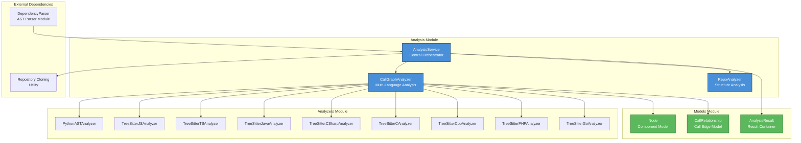
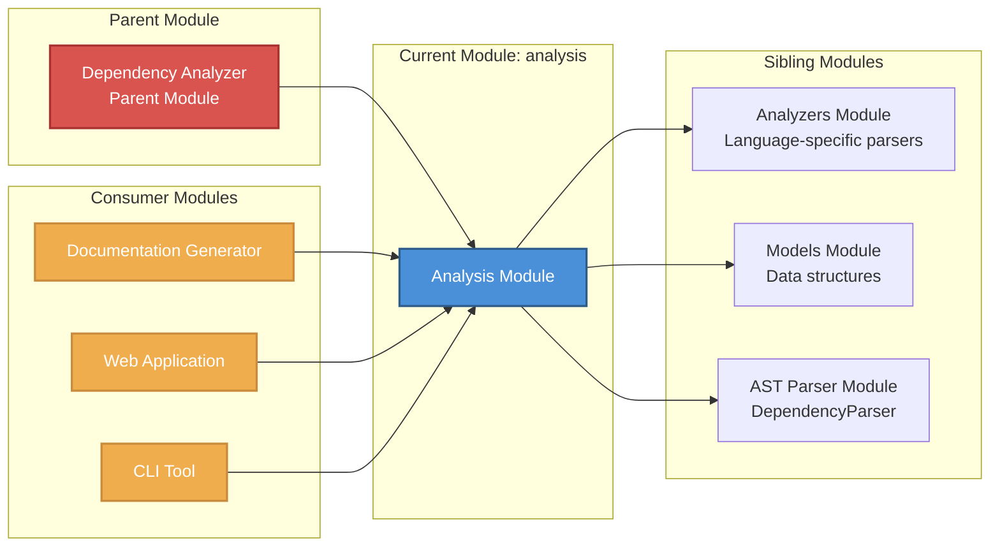
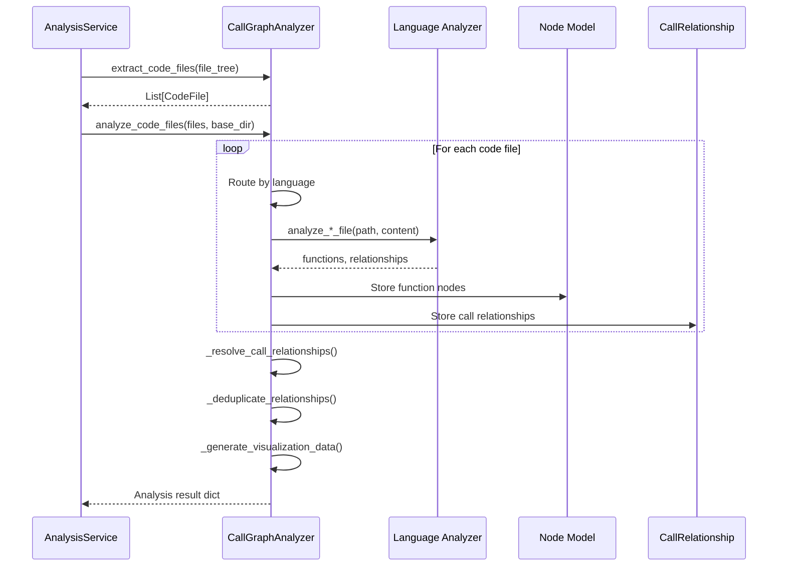
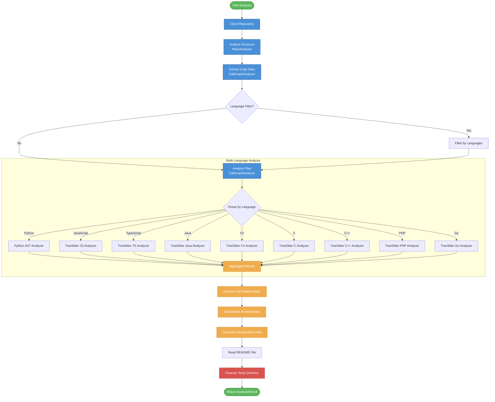
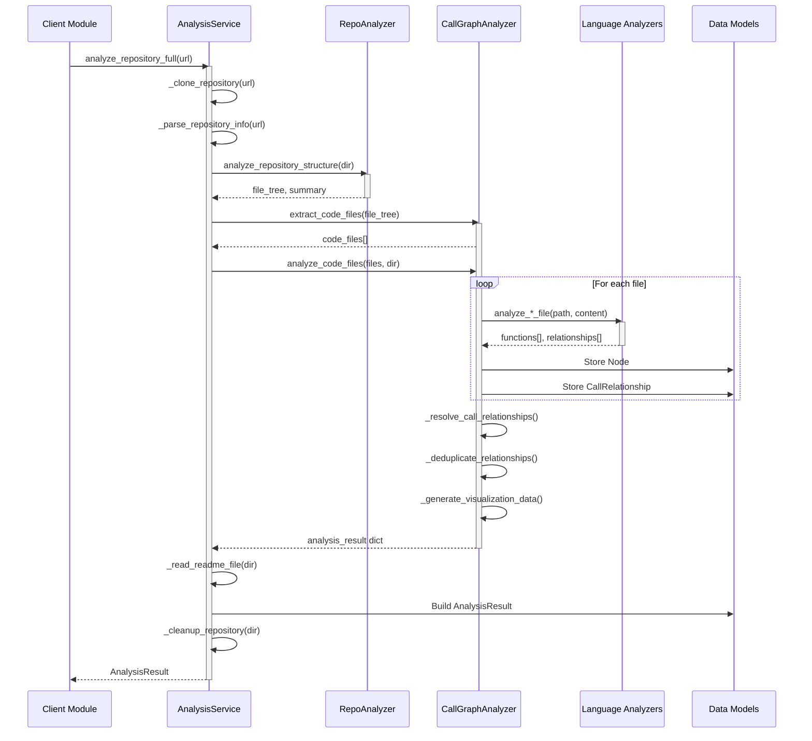

# Analysis Module

## Overview

The **Analysis Module** is the core engine of CodeWiki's dependency analysis system. It provides comprehensive repository analysis capabilities, including file structure parsing, multi-language AST (Abstract Syntax Tree) analysis, and call graph generation. This module serves as the foundation for understanding code relationships across diverse programming languages.

### Purpose

The Analysis Module enables:
- **Repository Structure Analysis**: Scanning and filtering repository file trees
- **Multi-Language Support**: Analyzing code in Python, JavaScript, TypeScript, Java, C#, C, C++, PHP, and Go
- **Call Graph Generation**: Building comprehensive function/method call relationship graphs
- **Dependency Mapping**: Extracting component dependencies for documentation generation

### Key Features

- **Language-Agnostic Analysis**: Unified interface for analyzing multiple programming languages
- **Configurable Filtering**: Include/exclude patterns for targeted analysis
- **Security-Conscious**: Safe file access with path validation
- **Automatic Cleanup**: Managed temporary directory handling for cloned repositories
- **Visualization Ready**: Cytoscape.js compatible output for interactive graph rendering

---

## Architecture

### Component Hierarchy



### Module Dependencies



---

## Core Components

### 1. AnalysisService

**File**: `codewiki/src/be/dependency_analyzer/analysis/analysis_service.py`

**Purpose**: Central orchestrator for the complete repository analysis workflow.

**Responsibilities**:
- Repository cloning and validation
- Coordination between RepoAnalyzer and CallGraphAnalyzer
- Multi-language filtering and support
- Result consolidation and cleanup management
- Both local and remote (GitHub) repository analysis

**Key Methods**:

| Method | Description |
|--------|-------------|
| `analyze_local_repository()` | Analyze a local repository folder with language filtering |
| `analyze_repository_full()` | Complete analysis including call graph generation |
| `analyze_repository_structure_only()` | Lightweight structure analysis without call graphs |
| `_clone_repository()` | Clone GitHub repository to temporary directory |
| `_analyze_structure()` | Build file tree with include/exclude filtering |
| `_analyze_call_graph()` | Perform multi-language AST analysis |
| `_cleanup_repository()` | Clean up temporary cloned repository |

**Usage Example**:
```python
from codewiki.src.be.dependency_analyzer.analysis.analysis_service import AnalysisService

service = AnalysisService()
result = service.analyze_repository_full(
    github_url="https://github.com/owner/repo",
    include_patterns=["*.py", "*.js"],
    exclude_patterns=["*test*", "*__pycache__*"]
)
```

**See Also**: [Documentation Generator Module](documentation_generator.md) - Uses AnalysisService for code analysis

---

### 2. CallGraphAnalyzer

**File**: `codewiki/src/be/dependency_analyzer/analysis/call_graph_analyzer.py`

**Purpose**: Multi-language call graph analysis orchestrator that coordinates language-specific analyzers.

**Responsibilities**:
- Routing files to appropriate language-specific analyzers
- Aggregating function nodes and call relationships
- Resolving call relationships across files
- Deduplicating relationships
- Generating visualization data (Cytoscape.js format)
- Generating LLM-optimized format

**Supported Languages**:
- Python (AST-based)
- JavaScript (Tree-sitter)
- TypeScript (Tree-sitter)
- Java (Tree-sitter)
- C# (Tree-sitter)
- C (Tree-sitter)
- C++ (Tree-sitter)
- PHP (Tree-sitter)
- Go (Tree-sitter)

**Key Methods**:

| Method | Description |
|--------|-------------|
| `analyze_code_files()` | Complete analysis of multiple code files |
| `extract_code_files()` | Extract code files from file tree structure |
| `_analyze_*_file()` | Language-specific analysis methods (9 variants) |
| `_resolve_call_relationships()` | Match function calls to definitions |
| `_deduplicate_relationships()` | Remove duplicate caller-callee pairs |
| `_generate_visualization_data()` | Create Cytoscape.js compatible graph data |
| `generate_llm_format()` | Generate LLM-optimized analysis format |
| `_select_most_connected_nodes()` | Filter to most connected nodes for large repos |

**Data Flow**:



**See Also**: [Analyzers Module](analyzers.md) - Contains language-specific analyzer implementations

---

### 3. RepoAnalyzer

**File**: `codewiki/src/be/dependency_analyzer/analysis/repo_analyzer.py`

**Purpose**: Repository structure analyzer that builds filtered file tree representations.

**Responsibilities**:
- Building hierarchical file tree structures
- Applying include/exclude pattern filtering
- Security validation (symlink detection, path escape prevention)
- File counting and size calculation
- Permission error handling

**Key Methods**:

| Method | Description |
|--------|-------------|
| `analyze_repository_structure()` | Main entry point for structure analysis |
| `_build_file_tree()` | Recursively build file tree with security checks |
| `_should_exclude_path()` | Check if path matches exclude patterns |
| `_should_include_file()` | Check if file matches include patterns |
| `_count_files()` | Count total files in tree |
| `_calculate_size()` | Calculate total size in KB |

**Pattern Matching**:
- Uses `fnmatch` for Unix shell-style wildcard matching
- Supports directory and file name patterns
- Default ignore patterns for common non-code directories

**Security Features**:
- Symlink rejection
- Path escape detection (prevents accessing files outside repo)
- Permission error handling

**See Also**: [Models Module](models.md) - Defines data structures used by RepoAnalyzer

---

## Data Models

### Node

**File**: `codewiki/src/be/dependency_analyzer/models/core.py`

Represents a code component (function, method, class, etc.) in the dependency graph.

```python
class Node(BaseModel):
    id: str                      # Unique identifier
    name: str                    # Component name
    component_type: str          # Type: function, method, class, etc.
    file_path: str              # Absolute file path
    relative_path: str          # Path relative to repo root
    depends_on: Set[str]        # Set of component IDs this depends on
    source_code: Optional[str]  # Source code snippet
    start_line: int             # Starting line number
    end_line: int               # Ending line number
    has_docstring: bool         # Whether docstring exists
    docstring: str              # Docstring content
    parameters: Optional[List[str]]  # Parameter names
    node_type: Optional[str]    # function, method, class, etc.
    base_classes: Optional[List[str]]  # For classes
    class_name: Optional[str]   # Parent class name (for methods)
    display_name: Optional[str] # Human-readable name
    component_id: Optional[str] # Fully qualified identifier
```

### CallRelationship

**File**: `codewiki/src/be/dependency_analyzer/models/core.py`

Represents a function/method call relationship between two components.

```python
class CallRelationship(BaseModel):
    caller: str          # ID of calling function
    callee: str          # ID of called function
    call_line: Optional[int]  # Line number where call occurs
    is_resolved: bool    # Whether callee was found in analyzed code
```

### AnalysisResult

**File**: `codewiki/src/be/dependency_analyzer/models/analysis.py`

Container for complete analysis results.

```python
class AnalysisResult(BaseModel):
    repository: Repository           # Repository metadata
    functions: List[Node]           # All discovered functions/methods
    relationships: List[CallRelationship]  # All call relationships
    file_tree: Dict[str, Any]       # Hierarchical file structure
    summary: Dict[str, Any]         # Analysis statistics
    visualization: Dict[str, Any]   # Cytoscape.js graph data
    readme_content: Optional[str]   # README file content
```

---

## Data Flow

### Complete Analysis Workflow



### Component Interaction Flow



---

## Integration with Other Modules

### Dependency Analyzer Module

The Analysis Module is a child of the **Dependency Analyzer** parent module, which provides:
- Utility functions for security and pattern matching
- Repository cloning utilities
- Base configuration and constants

**See**: [Dependency Analyzer Module](dependency_analyzer.md)

### Analyzers Module

The Analysis Module depends on the **Analyzers Module** for language-specific parsing:
- Each language has a dedicated analyzer implementation
- Analyzers return `Node` and `CallRelationship` objects
- Analysis Module routes files to appropriate analyzers

**See**: [Analyzers Module](analyzers.md)

### Models Module

The Analysis Module uses data models from the **Models Module**:
- `Node`: Represents code components
- `CallRelationship`: Represents function calls
- `AnalysisResult`: Container for analysis output
- `Repository`: Repository metadata

**See**: [Models Module](models.md)

### AST Parser Module

The **DependencyParser** in the AST Parser Module uses AnalysisService:
- Wraps AnalysisService for component extraction
- Converts analysis results to component dictionaries
- Saves dependency graphs to JSON

**See**: [AST Parser Module](ast_parser.md)

### Documentation Generator Module

The **Documentation Generator** consumes analysis results:
- Uses AnalysisService for repository analysis
- Processes Node and CallRelationship data
- Generates documentation from dependency graphs

**See**: [Documentation Generator Module](documentation_generator.md)

### Web Application Module

The **Web Application** integrates analysis capabilities:
- BackgroundWorker processes analysis jobs
- CacheManager stores analysis results
- WebRoutes expose analysis endpoints
- GitHubRepoProcessor handles repository input

**See**: [Web Application Module](web_application.md)

### CLI Module

The **CLI Tool** provides command-line access:
- CLIDocumentationGenerator wraps analysis functionality
- GitManager handles repository operations
- ProgressTracker shows analysis progress

**See**: [CLI Module](cli.md)

---

## Configuration

### Include/Exclude Patterns

The Analysis Module supports configurable file filtering:

**Default Include Patterns** (from `dependency_analyzer.utils.patterns`):
- Code file extensions for supported languages

**Default Exclude Patterns**:
- `.git/`, `__pycache__/`, `node_modules/`
- `*.pyc`, `*.pyo`, `*.so`, `*.dll`
- Test directories, build artifacts, etc.

**Custom Patterns**:
```python
service = AnalysisService()
result = service.analyze_repository_full(
    github_url="https://github.com/owner/repo",
    include_patterns=["src/**/*.py", "lib/**/*.js"],
    exclude_patterns=["*test*", "*mock*", "*fixture*"]
)
```

### Language Filtering

Limit analysis to specific languages:
```python
result = service.analyze_local_repository(
    repo_path="/path/to/repo",
    languages=["python", "javascript"],
    max_files=50
)
```

---

## Error Handling

### Security Validation

- **Path Traversal Prevention**: All file paths are validated against repository root
- **Symlink Rejection**: Symlinks are excluded to prevent escape attacks
- **Safe File Access**: Uses `safe_open_text()` for all file reads

### Exception Handling

- **File Analysis Errors**: Logged and skipped, analysis continues
- **Repository Clone Failures**: Raised as RuntimeError with cleanup
- **Permission Errors**: Handled gracefully during tree traversal
- **Cleanup on Failure**: Temporary directories cleaned on exceptions

### Logging

Comprehensive logging at DEBUG level:
- File analysis progress
- Function/relationship counts
- Resolution and deduplication statistics
- Error details with tracebacks

---

## Performance Considerations

### Large Repository Handling

- **File Limiting**: `max_files` parameter limits analysis scope
- **Node Selection**: `_select_most_connected_nodes()` filters to important nodes
- **Deduplication**: Removes duplicate relationships to reduce noise

### Memory Management

- **Streaming Analysis**: Files processed one at a time
- **Automatic Cleanup**: Temporary directories removed after analysis
- **Destructor Cleanup**: `__del__` ensures cleanup on service destruction

### Visualization Optimization

- **Resolved Relationships Only**: Only resolved calls included in graph
- **Summary Statistics**: Quick overview without full graph traversal
- **Cytoscape.js Format**: Optimized for client-side rendering

---

## Testing Guidelines

### Unit Testing

Test individual components:
- `RepoAnalyzer`: Pattern matching, file tree building
- `CallGraphAnalyzer`: Relationship resolution, deduplication
- `AnalysisService`: Workflow orchestration, cleanup

### Integration Testing

Test complete workflows:
- Local repository analysis
- GitHub repository cloning and analysis
- Multi-language repository analysis
- Error handling and cleanup

### Test Fixtures

Use sample repositories with:
- Single-language projects
- Multi-language projects
- Edge cases (symlinks, permissions, large files)

---

## Future Enhancements

### Planned Features

1. **Additional Language Support**: Rust, Ruby, Swift
2. **Cross-Language Call Detection**: Inter-language call resolution
3. **Incremental Analysis**: Cache-based re-analysis of changed files
4. **Dependency Version Tracking**: Package dependency analysis
5. **Code Quality Metrics**: Complexity, coverage integration

### Architecture Improvements

1. **Plugin System**: Dynamic language analyzer loading
2. **Parallel Analysis**: Multi-threaded file processing
3. **Streaming Results**: Progressive result delivery for large repos
4. **Graph Database Storage**: Persistent dependency graph storage

---

## API Reference

### AnalysisService

```python
class AnalysisService:
    def __init__(self)
    def analyze_local_repository(repo_path, max_files=100, languages=None) -> Dict
    def analyze_repository_full(github_url, include_patterns=None, exclude_patterns=None) -> AnalysisResult
    def analyze_repository_structure_only(github_url, include_patterns=None, exclude_patterns=None) -> Dict
    def cleanup_all()
```

### CallGraphAnalyzer

```python
class CallGraphAnalyzer:
    def __init__(self)
    def analyze_code_files(code_files, base_dir) -> Dict
    def extract_code_files(file_tree) -> List[Dict]
    def generate_llm_format() -> Dict
```

### RepoAnalyzer

```python
class RepoAnalyzer:
    def __init__(include_patterns=None, exclude_patterns=None)
    def analyze_repository_structure(repo_dir) -> Dict
```

---

## Related Documentation

- [Dependency Analyzer Module](dependency_analyzer.md) - Parent module overview
- [Analyzers Module](analyzers.md) - Language-specific analyzers
- [Models Module](models.md) - Data model definitions
- [AST Parser Module](ast_parser.md) - DependencyParser implementation
- [Documentation Generator Module](documentation_generator.md) - Analysis consumer
- [Web Application Module](web_application.md) - Web integration
- [CLI Module](cli.md) - Command-line interface
