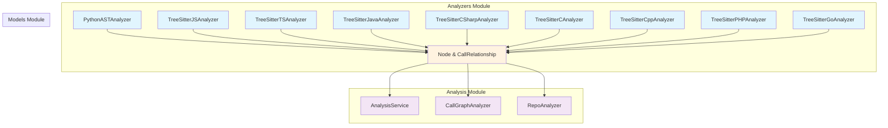
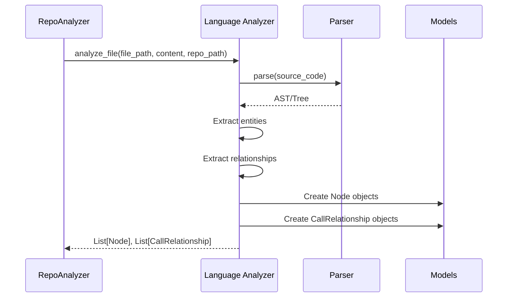

# Analyzers Module

## Overview

The **analyzers** module is a core component of the CodeWiki dependency analysis system. It provides language-specific source code analyzers that extract code entities (classes, functions, methods, interfaces, etc.) and their relationships from multiple programming languages. This module serves as the foundation for building dependency graphs and understanding code structure across diverse technology stacks.

## Purpose

The analyzers module is responsible for:
- **Parsing source code** using language-appropriate techniques (AST for Python, tree-sitter for other languages)
- **Extracting code entities** such as classes, functions, methods, interfaces, structs, and variables
- **Identifying relationships** including function calls, inheritance, implementations, and type dependencies
- **Generating standardized output** in the form of `Node` and `CallRelationship` objects for downstream processing

## Architecture



## Supported Languages

| Language | Analyzer Class | Parsing Technology | File Extensions |
|----------|---------------|-------------------|-----------------|
| Python | `PythonASTAnalyzer` | Python `ast` module | `.py`, `.pyx` |
| JavaScript | `TreeSitterJSAnalyzer` | tree-sitter-javascript | `.js`, `.jsx`, `.mjs`, `.cjs` |
| TypeScript | `TreeSitterTSAnalyzer` | tree-sitter-typescript | `.ts`, `.tsx` |
| Java | `TreeSitterJavaAnalyzer` | tree-sitter-java | `.java` |
| C# | `TreeSitterCSharpAnalyzer` | tree-sitter-c-sharp | `.cs` |
| C | `TreeSitterCAnalyzer` | tree-sitter-c | `.c`, `.h` |
| C++ | `TreeSitterCppAnalyzer` | tree-sitter-cpp | `.cpp`, `.cc`, `.cxx`, `.hpp`, `.h` |
| PHP | `TreeSitterPHPAnalyzer` | tree-sitter-php | `.php`, `.phtml`, `.inc` |
| Go | `TreeSitterGoAnalyzer` | tree-sitter-go | `.go` |

## Core Components

### Language-Specific Analyzers

Each language analyzer follows a consistent interface pattern:

1. **Initialization**: Accepts file path, content, and optional repository path
2. **Analysis**: Parses source code and extracts entities
3. **Output**: Returns lists of `Node` and `CallRelationship` objects

Detailed documentation for each analyzer group:

- **[Python Analyzer](python_analyzer.md)** - AST-based analysis for Python files
- **[JavaScript & TypeScript Analyzers](javascript_typescript_analyzers.md)** - Tree-sitter analysis for web languages
- **[Java & C# Analyzers](java_csharp_analyzers.md)** - Tree-sitter analysis for enterprise OOP languages
- **[C & C++ Analyzers](c_cpp_analyzers.md)** - Tree-sitter analysis for systems programming languages
- **[PHP & Go Analyzers](php_go_analyzers.md)** - Tree-sitter analysis for web backend and systems languages

#### Python Analyzer
- Uses Python's built-in `ast` module for parsing
- Extracts classes, functions, and methods
- Tracks inheritance relationships and function calls
- Filters out test functions and built-in calls

#### Tree-Sitter Analyzers (JavaScript, TypeScript, Java, C#, C, C++, PHP, Go)
- Use tree-sitter parsers for language-agnostic AST traversal
- Extract language-specific entities (classes, interfaces, structs, etc.)
- Identify various relationship types (calls, inheritance, implementations, type dependencies)
- Handle language-specific features (namespaces, modules, generics, etc.)

### Common Data Models

All analyzers produce standardized output using models from the [models](models.md) module:

- **`Node`**: Represents a code entity with metadata (name, type, location, source code, parameters, etc.)
- **`CallRelationship`**: Represents a relationship between two entities (caller, callee, call line, resolution status)

## Data Flow



## Component ID Generation

All analyzers generate consistent component IDs using the pattern:
```
{module_path}.{class_name}.{entity_name}
```

Where:
- `module_path`: Relative file path with separators converted to dots (e.g., `src.utils.helpers`)
- `class_name`: Optional class/struct name for methods
- `entity_name`: Name of the function, method, class, etc.

Examples:
- Python function: `src.utils.helpers.format_data`
- Java method: `com.example.Service.processRequest`
- JavaScript class: `src.components.Button`
- Go method: `pkg.server.Handler.handle`

## Relationship Types

Different analyzers extract different types of relationships based on language features:

| Relationship Type | Python | JavaScript | TypeScript | Java | C# | C/C++ | PHP | Go |
|------------------|--------|------------|------------|------|-----|-------|-----|-----|
| Function Calls | ✓ | ✓ | ✓ | ✓ | ✓ | ✓ | ✓ | ✓ |
| Class Inheritance | ✓ | ✓ | ✓ | ✓ | ✓ | ✓ | ✓ | - |
| Interface Implementation | - | - | ✓ | ✓ | ✓ | - | ✓ | ✓ |
| Type Dependencies | - | ✓ | ✓ | ✓ | ✓ | - | ✓ | - |
| Object Creation | - | ✓ | ✓ | ✓ | ✓ | ✓ | ✓ | - |
| Field/Property Types | - | - | - | ✓ | ✓ | - | ✓ | - |
| Namespace/Use Statements | - | - | - | - | - | - | ✓ | - |
| Global Variable Usage | - | - | - | - | - | ✓ | - | - |

## Integration Points

### Upstream Dependencies
- **Models Module** ([models.md](models.md)): Provides `Node` and `CallRelationship` data structures
- **AST Parser** ([ast_parser.md](ast_parser.md)): May coordinate with dependency parser for cross-file resolution

### Downstream Consumers
- **Analysis Module** ([analysis.md](analysis.md)): 
  - `CallGraphAnalyzer`: Builds call graphs from extracted relationships
  - `RepoAnalyzer`: Orchestrates file analysis across repositories
  - `AnalysisService`: Provides high-level analysis API
- **Documentation Generator** ([documentation_generator.md](documentation_generator.md)): Uses extracted entities for documentation generation
- **Dependency Graphs Builder**: Constructs visual dependency graphs

## Error Handling

All analyzers implement robust error handling:
- **Syntax Errors**: Logged as warnings, analysis continues
- **Parser Initialization Failures**: Logged as errors, file skipped
- **Recursion Limits**: Protected against stack overflow (especially PHP analyzer)
- **Encoding Issues**: UTF-8 encoding assumed, errors logged

## Performance Considerations

- **Tree-Sitter Parsers**: Compiled parsers provide fast AST generation
- **Duplicate Prevention**: Relationship deduplication using seen sets
- **Template File Skipping**: PHP analyzer skips template files to avoid unnecessary processing
- **Built-in Filtering**: System/library functions filtered to reduce noise

## Usage Example

```python
from codewiki.src.be.dependency_analyzer.analyzers.python import analyze_python_file
from codewiki.src.be.dependency_analyzer.analyzers.javascript import analyze_javascript_file_treesitter

# Analyze Python file
nodes, relationships = analyze_python_file(
    file_path="src/example.py",
    content=file_content,
    repo_path="/path/to/repo"
)

# Analyze JavaScript file
js_nodes, js_relationships = analyze_javascript_file_treesitter(
    file_path="src/example.js",
    content=js_content,
    repo_path="/path/to/repo"
)
```

## Extension Points

To add support for a new language:

1. Create a new analyzer class following the existing pattern
2. Implement parsing logic (AST or tree-sitter)
3. Extract entities as `Node` objects
4. Extract relationships as `CallRelationship` objects
5. Generate consistent component IDs
6. Add language-specific filtering (built-ins, primitives, etc.)

## Related Documentation

### Sub-Module Documentation
- [Python Analyzer](python_analyzer.md) - Detailed documentation for Python AST analyzer
- [JavaScript & TypeScript Analyzers](javascript_typescript_analyzers.md) - Web language analyzers
- [Java & C# Analyzers](java_csharp_analyzers.md) - Enterprise OOP language analyzers
- [C & C++ Analyzers](c_cpp_analyzers.md) - Systems programming language analyzers
- [PHP & Go Analyzers](php_go_analyzers.md) - Backend and systems language analyzers

### Other Modules
- [Models Module](models.md) - Data structures used by analyzers
- [Analysis Module](analysis.md) - Higher-level analysis orchestration
- [AST Parser](ast_parser.md) - Dependency parsing utilities
- [Documentation Generator](documentation_generator.md) - Downstream consumer of analysis results
