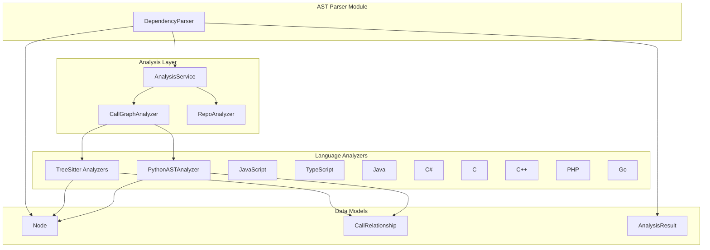
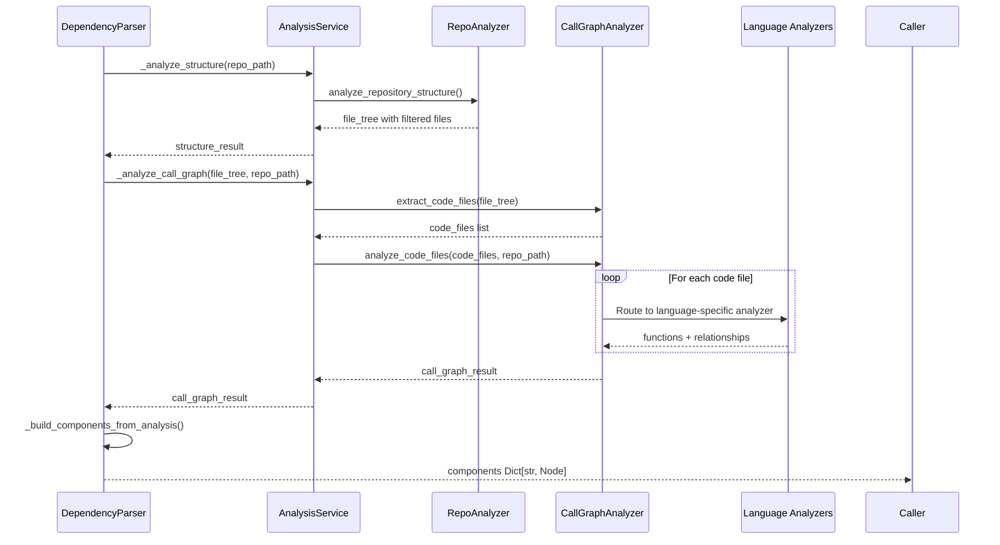
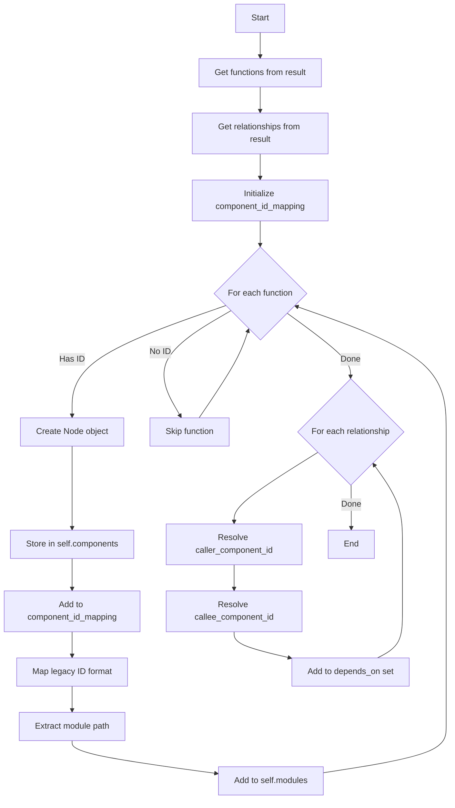
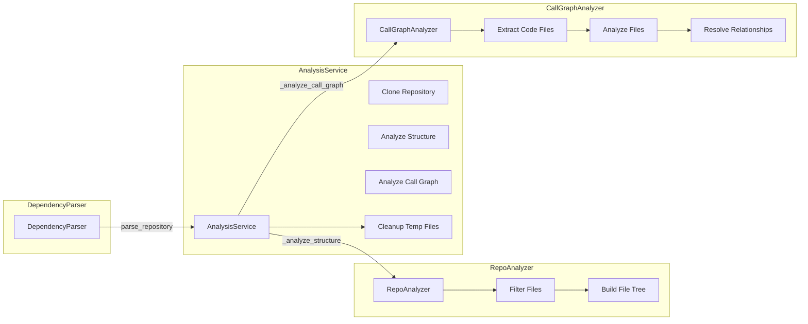
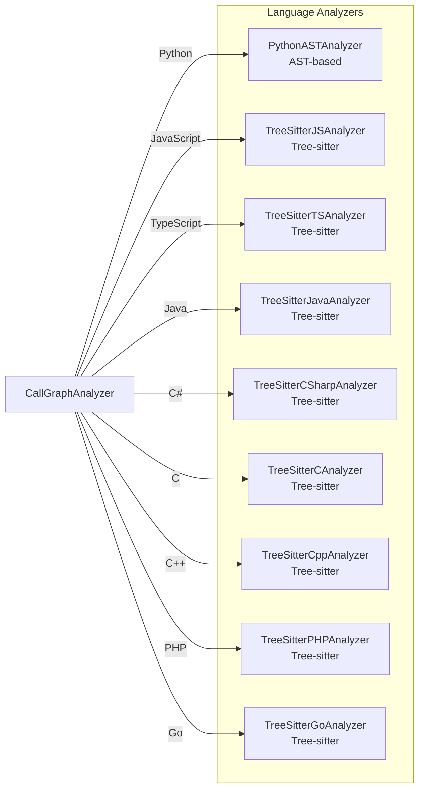
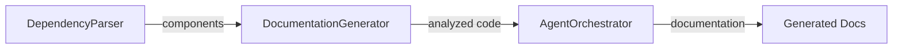
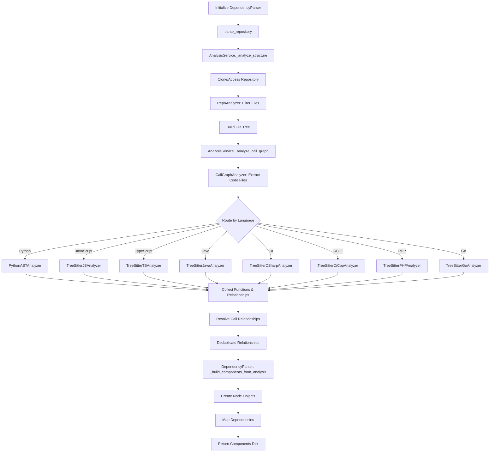
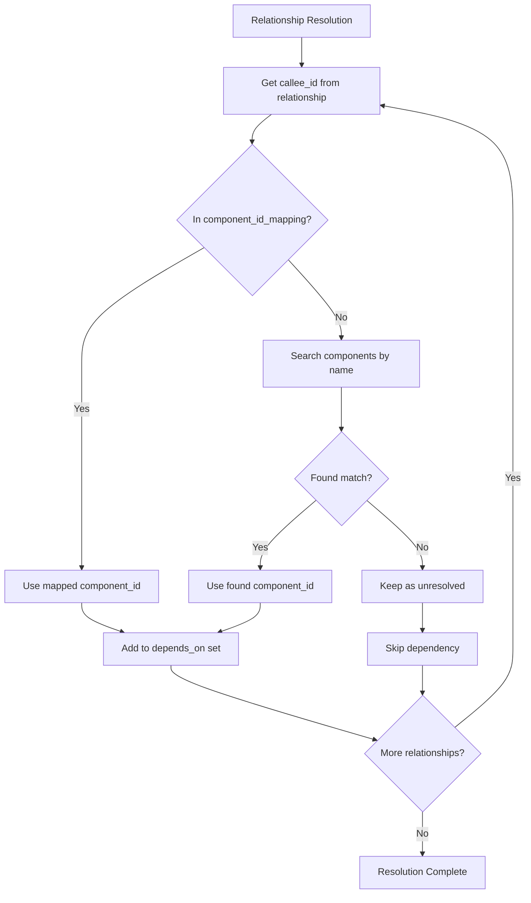

# AST Parser Module

## Introduction

The **AST Parser** module is a core component of the CodeWiki dependency analysis system, responsible for extracting code components and their relationships from multi-language repositories. It serves as the primary interface for parsing source code files, building component representations, and generating dependency graphs that power CodeWiki's documentation generation capabilities.

The module's centerpiece is the [`DependencyParser`](#dependencyparser-class) class, which orchestrates the complete parsing workflow by leveraging the [`AnalysisService`](analysis_service.md) and language-specific analyzers to produce structured [`Node`](models.md) representations of code components.

## Architecture Overview



## Core Component: DependencyParser

### Class Definition

The `DependencyParser` class is the main entry point for repository parsing operations. It provides a high-level API for extracting code components from repositories while supporting customizable file filtering patterns.

```python
class DependencyParser:
    """Parser for extracting code components from multi-language repositories."""
```

### Constructor

```python
def __init__(
    self, 
    repo_path: str, 
    include_patterns: List[str] = None, 
    exclude_patterns: List[str] = None
)
```

**Parameters:**
- `repo_path` (str): Absolute or relative path to the repository root directory
- `include_patterns` (List[str], optional): File patterns to include (e.g., `["*.cs", "*.py"]`)
- `exclude_patterns` (List[str], optional): File/directory patterns to exclude (e.g., `["*Tests*", "node_modules"]`)

**Internal State:**
- `self.repo_path`: Normalized absolute path to the repository
- `self.components`: Dictionary mapping component IDs to [`Node`](models.md) objects
- `self.modules`: Set of discovered module paths
- `self.analysis_service`: Instance of [`AnalysisService`](analysis_service.md) for orchestration

### Key Methods

#### parse_repository()

The primary method for parsing a repository and extracting all code components.

```python
def parse_repository(self, filtered_folders: List[str] = None) -> Dict[str, Node]
```

**Process Flow:**



**Steps:**
1. **Structure Analysis**: Calls `AnalysisService._analyze_structure()` to build a filtered file tree using [`RepoAnalyzer`](analysis_service.md)
2. **Call Graph Analysis**: Calls `AnalysisService._analyze_call_graph()` to analyze code files and extract function relationships
3. **Component Building**: Transforms analysis results into [`Node`](models.md) objects via `_build_components_from_analysis()`
4. **Return**: Returns dictionary of component IDs mapped to Node objects

**Returns:** `Dict[str, Node]` - Mapping of component IDs to Node objects

#### _build_components_from_analysis()

Internal method that transforms raw analysis results into structured component representations.

```python
def _build_components_from_analysis(self, call_graph_result: Dict)
```

**Processing Logic:**



**Key Operations:**
- Creates [`Node`](models.md) objects from function dictionaries
- Builds bidirectional ID mapping (component ID ↔ legacy ID format)
- Extracts module paths from component IDs
- Resolves and stores dependency relationships in `depends_on` sets

**Node Field Mapping:**
| Source Field | Node Field | Notes |
|-------------|-----------|-------|
| `id` | `id` | Primary component identifier |
| `name` | `name` | Component name |
| `component_type`/`node_type` | `component_type` | Type of component |
| `file_path` | `file_path` | Absolute file path |
| `relative_path` | `relative_path` | Path relative to repo root |
| `source_code`/`code_snippet` | `source_code` | Actual code content |
| `start_line` | `start_line` | Starting line number |
| `end_line` | `end_line` | Ending line number |
| `docstring` | `docstring` | Documentation string |
| `parameters` | `parameters` | Function parameters list |
| `base_classes` | `base_classes` | Inheritance information |
| `class_name` | `class_name` | Parent class (for methods) |

#### save_dependency_graph()

Exports the parsed dependency graph to a JSON file.

```python
def save_dependency_graph(self, output_path: str)
```

**Process:**
1. Converts all [`Node`](models.md) objects to dictionaries using `model_dump()`
2. Converts `depends_on` sets to lists for JSON serialization
3. Creates output directory if it doesn't exist
4. Writes JSON file with UTF-8 encoding

**Returns:** `Dict` - The serialized dependency graph data

**Example Output Structure:**
```json
{
  "module.path.ClassName.method": {
    "id": "module.path.ClassName.method",
    "name": "method",
    "component_type": "method",
    "file_path": "/repo/module/path.py",
    "relative_path": "module/path.py",
    "source_code": "def method(self): ...",
    "start_line": 10,
    "end_line": 15,
    "has_docstring": true,
    "docstring": "Method documentation",
    "parameters": ["self"],
    "depends_on": ["module.path.other_function"],
    "node_type": "method",
    "class_name": "ClassName"
  }
}
```

### Helper Methods

#### _determine_component_type()

Determines the component type based on function metadata.

```python
def _determine_component_type(self, func_dict: Dict) -> str
```

**Logic:**
- Returns `"method"` if `is_method` flag is set
- Returns node type for classes, interfaces, structs, enums, etc.
- Defaults to `"function"` for regular functions

#### _file_to_module_path()

Converts a file path to a dot-separated module path.

```python
def _file_to_module_path(self, file_path: str) -> str
```

**Process:**
1. Removes file extension (supports 15+ programming language extensions)
2. Replaces path separators with dots
3. Returns module-style path (e.g., `src/utils/helpers.py` → `src.utils.helpers`)

**Supported Extensions:** `.py`, `.js`, `.ts`, `.java`, `.cs`, `.cpp`, `.hpp`, `.h`, `.c`, `.tsx`, `.jsx`, `.cc`, `.mjs`, `.cxx`, `.cjs`

## Integration with Analysis Service

The `DependencyParser` relies heavily on the [`AnalysisService`](analysis_service.md) for repository analysis operations. This relationship enables:

### Analysis Workflow



### Service Methods Used

| Method | Purpose | Returns |
|--------|---------|---------|
| `_analyze_structure()` | Analyzes repository file structure with filtering | `Dict` with file_tree and summary |
| `_analyze_call_graph()` | Performs multi-language call graph analysis | `Dict` with functions and relationships |

## Language Support

The AST Parser supports multiple programming languages through specialized analyzers routed by the [`CallGraphAnalyzer`](analysis_service.md):



**Analysis Approaches:**
- **Python**: Uses native `ast` module for AST parsing
- **Other Languages**: Use Tree-sitter parsers for language-agnostic AST analysis

For detailed information about language-specific analyzers, see:
- [Python Analyzer](python_analyzer.md)
- [JavaScript/TypeScript Analyzers](javascript_typescript_analyzers.md)
- [Java/C# Analyzers](java_csharp_analyzers.md)
- [C/C++ Analyzers](c_cpp_analyzers.md)
- [PHP/Go Analyzers](php_go_analyzers.md)

## Data Models

### Node

The [`Node`](models.md) class represents a single code component (function, class, method, etc.).

**Key Fields:**
- `id`: Unique component identifier (dot-separated module path)
- `name`: Component name
- `component_type`: Type classification (function, method, class, etc.)
- `file_path`: Absolute file path
- `relative_path`: Path relative to repository root
- `depends_on`: Set of component IDs this node depends on
- `source_code`: Actual source code content
- `start_line`/`end_line`: Location in file
- `docstring`: Documentation string
- `parameters`: Function/method parameters
- `base_classes`: Inherited classes (for classes)
- `class_name`: Parent class (for methods)

### CallRelationship

Represents a call relationship between two components.

**Fields:**
- `caller`: Component ID of the calling function
- `callee`: Component ID of the called function
- `call_line`: Line number where the call occurs
- `is_resolved`: Whether the callee was found in the analyzed code

### AnalysisResult

Complete analysis result container used by [`AnalysisService`](analysis_service.md).

**Fields:**
- `repository`: Repository metadata
- `functions`: List of [`Node`](models.md) objects
- `relationships`: List of [`CallRelationship`](models.md) objects
- `file_tree`: Repository file structure
- `summary`: Analysis statistics
- `visualization`: Graph visualization data
- `readme_content`: Repository README content

## Usage Examples

### Basic Repository Parsing

```python
from codewiki.src.be.dependency_analyzer.ast_parser import DependencyParser

# Initialize parser
parser = DependencyParser(
    repo_path="/path/to/repository",
    include_patterns=["*.py", "*.js"],
    exclude_patterns=["*test*", "node_modules"]
)

# Parse repository
components = parser.parse_repository()

# Access component information
for component_id, node in components.items():
    print(f"{node.name} ({node.component_type})")
    print(f"  File: {node.relative_path}")
    print(f"  Dependencies: {node.depends_on}")
    print(f"  Docstring: {node.docstring[:100]}...")
```

### Exporting Dependency Graph

```python
# Save dependency graph to JSON
output_path = "/output/dependency_graph.json"
graph_data = parser.save_dependency_graph(output_path)

print(f"Exported {len(graph_data)} components to {output_path}")
```

### Integration with Documentation Generation

The AST Parser integrates with the [`DocumentationGenerator`](documentation_generator.md) to provide component information for documentation generation:



## Process Flows

### Complete Parsing Workflow



### Component ID Resolution



## Dependencies

The AST Parser module depends on the following modules:

| Module | Components Used | Purpose |
|--------|----------------|---------|
| [`AnalysisService`](analysis_service.md) | `AnalysisService` | Orchestrates repository analysis workflow |
| [`Models`](models.md) | `Node`, `CallRelationship`, `AnalysisResult` | Data structures for components and relationships |
| [`CallGraphAnalyzer`](analysis_service.md) | `CallGraphAnalyzer` | Multi-language call graph generation |
| [`RepoAnalyzer`](analysis_service.md) | `RepoAnalyzer` | Repository file structure analysis |
| [Python Analyzer](python_analyzer.md) | `PythonASTAnalyzer` | Python-specific AST analysis |
| [Tree-sitter Analyzers](javascript_typescript_analyzers.md) | Various | Analysis for JS, TS, Java, C#, C, C++, PHP, Go |

## Related Modules

- **[Analysis Service](analysis_service.md)**: Central orchestration service for repository analysis
- **[Models](models.md)**: Core data models (Node, CallRelationship, AnalysisResult)
- **[Call Graph Analyzer](analysis_service.md)**: Multi-language call graph generation
- **[Documentation Generator](documentation_generator.md)**: Uses parsed components for documentation generation
- **[Dependency Graphs Builder](documentation_generator.md)**: Builds dependency graphs for visualization

## Configuration Options

### Include Patterns

Control which files are analyzed:

```python
# Only analyze Python and C# files
parser = DependencyParser(
    repo_path="/repo",
    include_patterns=["*.py", "*.cs"]
)
```

### Exclude Patterns

Filter out unwanted files/directories:

```python
# Exclude test files and build directories
parser = DependencyParser(
    repo_path="/repo",
    exclude_patterns=["*test*", "*Test*", "build", "dist", "node_modules"]
)
```

### Default Patterns

If no patterns are specified, the system uses default patterns defined in [`RepoAnalyzer`](analysis_service.md):
- **Default Includes**: All code files with supported extensions
- **Default Excludes**: Common build directories, virtual environments, package managers, etc.

## Error Handling

The AST Parser implements robust error handling:

1. **Syntax Errors**: Language analyzers catch and log syntax errors without failing the entire analysis
2. **File Access Errors**: Permission errors and missing files are logged and skipped
3. **Path Security**: Symlinks and path traversal attempts are rejected for security
4. **Cleanup**: Temporary directories are automatically cleaned up after analysis

## Performance Considerations

- **File Filtering**: Use `include_patterns` and `exclude_patterns` to reduce analysis scope
- **Large Repositories**: The parser processes files sequentially; consider filtering for very large codebases
- **Memory Usage**: All components are stored in memory; use `max_files` parameter in [`AnalysisService`](analysis_service.md) for large repositories
- **Caching**: Consider caching parsed results for repeated analysis of the same repository

## Logging

The module uses Python's logging framework with debug-level logging:

```python
logger = logging.getLogger(__name__)
logger.setLevel(logging.DEBUG)
```

**Log Messages Include:**
- Repository parsing start/completion
- Custom pattern usage
- Component and module counts
- Dependency graph save operations
