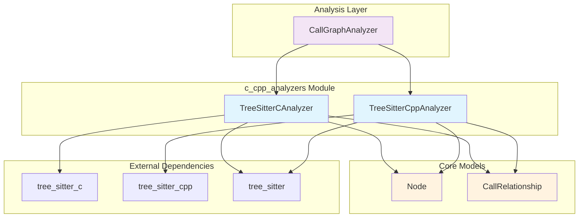
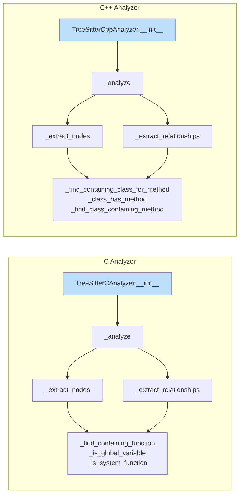
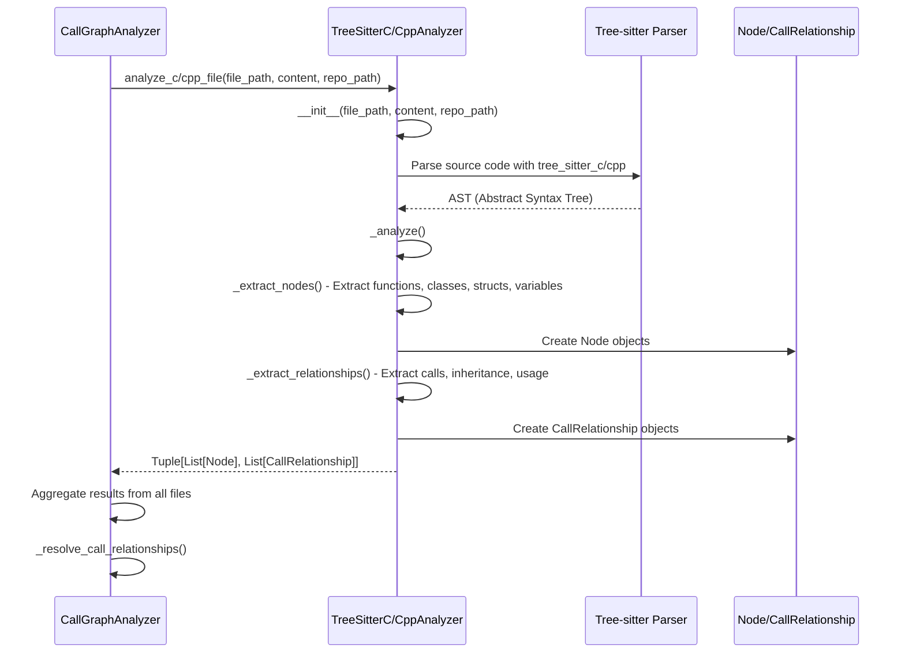
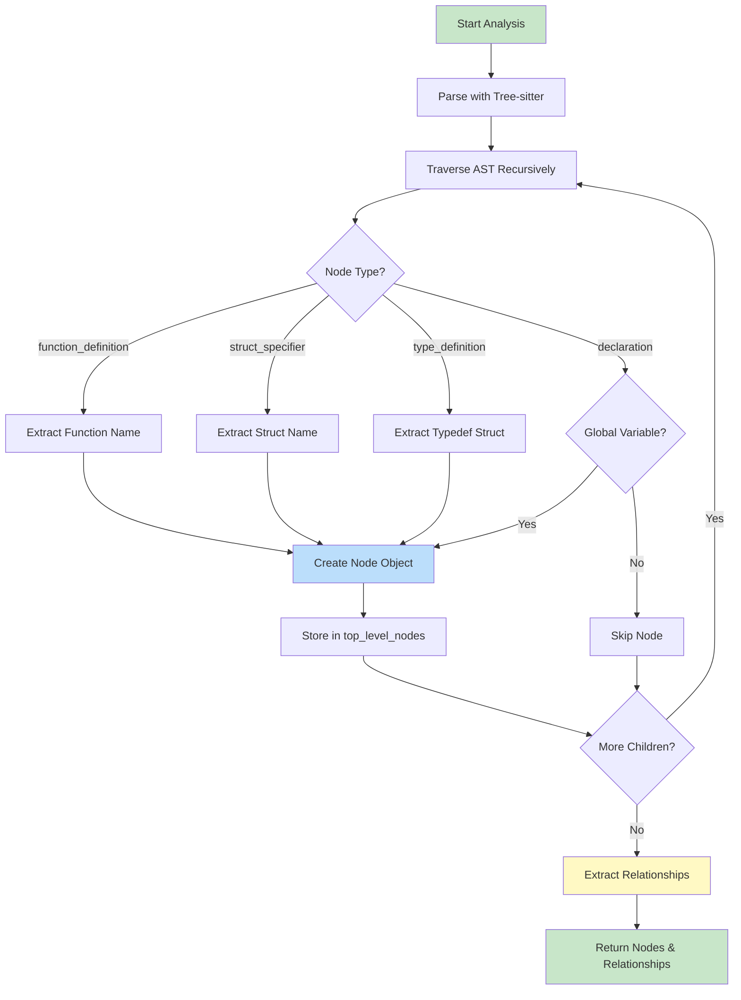
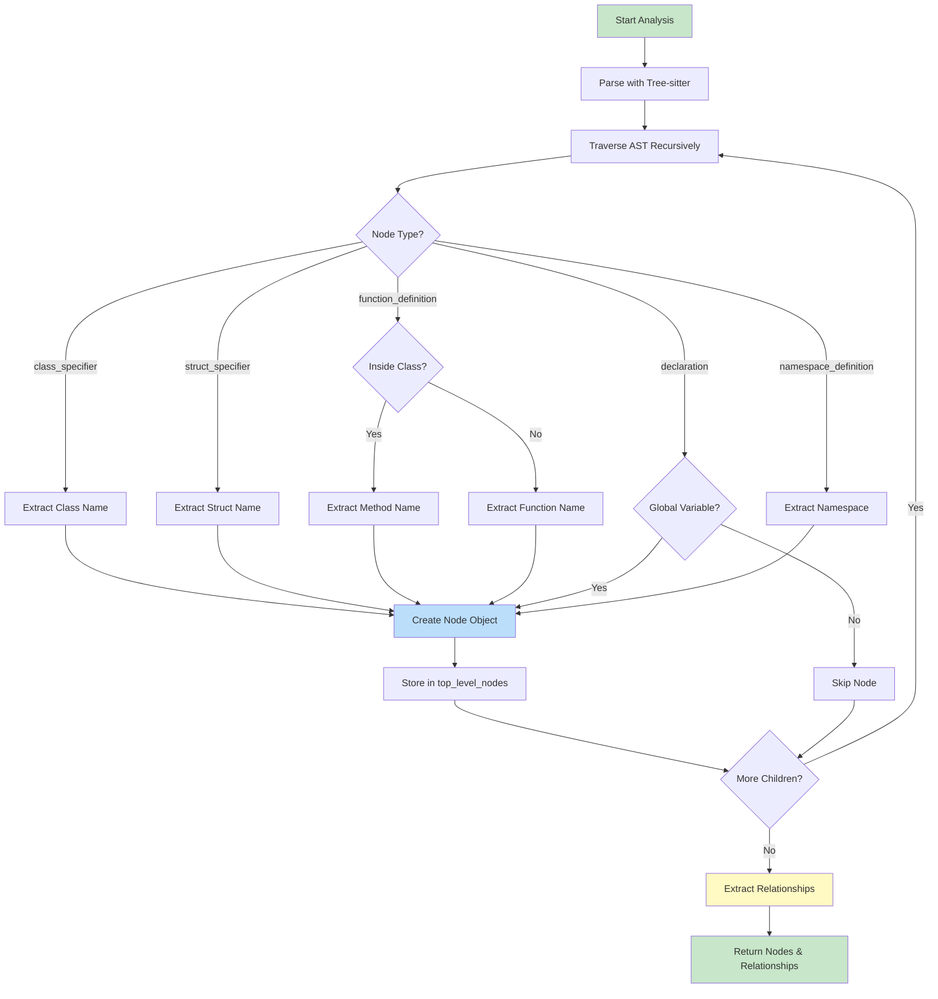
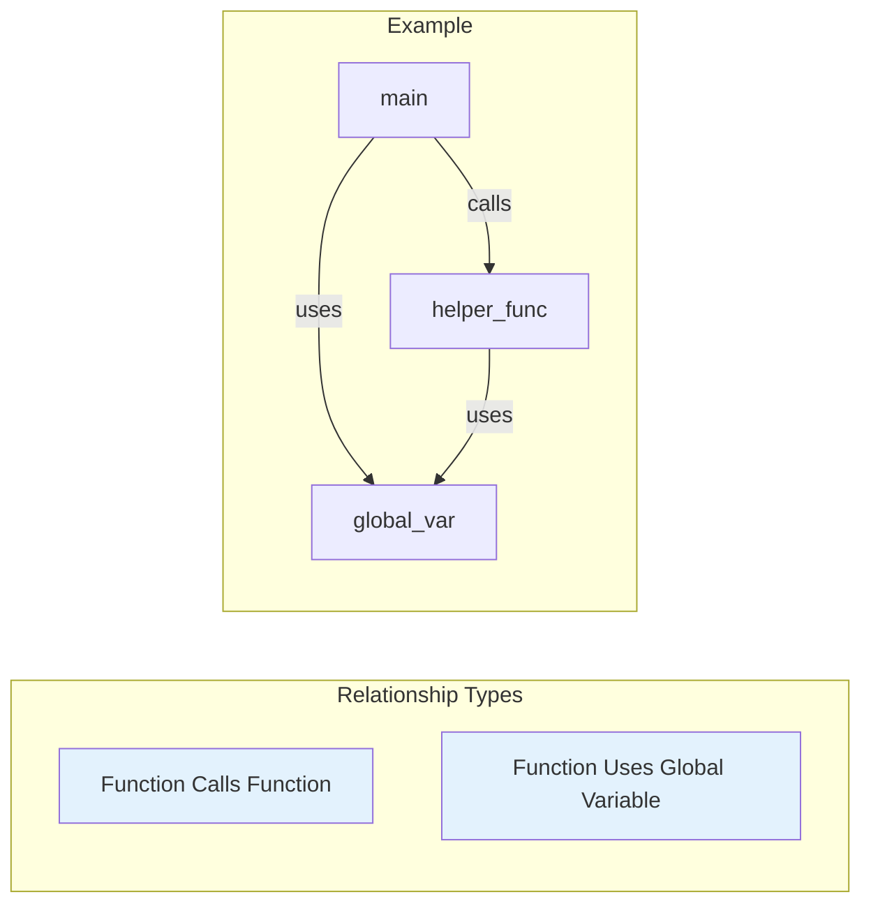
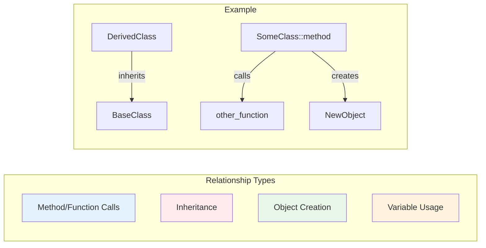
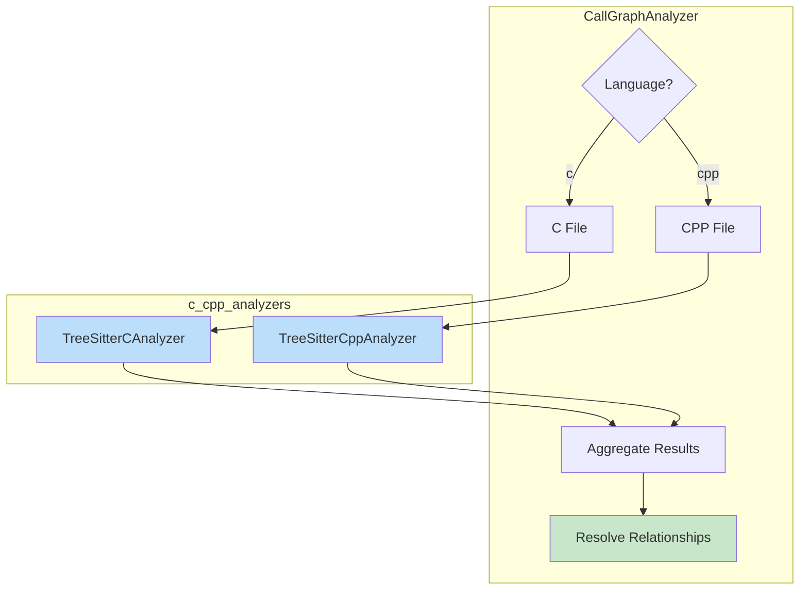

# C/C++ Analyzers Module

## Introduction

The **c_cpp_analyzers** module provides specialized static analysis capabilities for C and C++ source code within the CodeWiki dependency analysis system. Built on top of the [Tree-sitter](https://tree-sitter.github.io/tree-sitter/) parsing library, this module extracts code structure information (functions, classes, structs, variables) and identifies relationships between code components (function calls, inheritance, variable usage).

This module is part of the broader [`dependency_analyzer`](dependency_analyzer.md) system and works alongside other language-specific analyzers to provide comprehensive multi-language code analysis.

## Module Overview



## Architecture

### Component Structure



### Key Components

| Component | File | Purpose |
|-----------|------|---------|
| `TreeSitterCAnalyzer` | `c.py` | Analyzes C source files (.c, .h) to extract functions, structs, global variables, and their relationships |
| `TreeSitterCppAnalyzer` | `cpp.py` | Analyzes C++ source files (.cpp, .cc, .cxx, .hpp, .h) to extract classes, structs, methods, functions, and their relationships |
| `analyze_c_file` | `c.py` | Convenience function that instantiates analyzer and returns results |
| `analyze_cpp_file` | `cpp.py` | Convenience function that instantiates analyzer and returns results |

## Data Flow

### Analysis Pipeline



### Node Extraction Flow (C)



### Node Extraction Flow (C++)



## Relationship Extraction

### C Language Relationships



### C++ Language Relationships



### Relationship Types Comparison

| Relationship Type | C Support | C++ Support | Description |
|------------------|-----------|-------------|-------------|
| Function Calls | ✅ | ✅ | One function/method calls another |
| Variable Usage | ✅ | ✅ | Function uses a global variable |
| Inheritance | ❌ | ✅ | Class inherits from base class |
| Object Creation | ❌ | ✅ | Function creates object instance with `new` |
| Method Calls | N/A | ✅ | Method calls another method (including member access) |

## Integration with CallGraphAnalyzer

The C/C++ analyzers integrate with the [`CallGraphAnalyzer`](dependency_analyzer.md) as part of the multi-language analysis pipeline:



### Integration Points

1. **File Routing**: `CallGraphAnalyzer._analyze_c_file()` and `CallGraphAnalyzer._analyze_cpp_file()` route C/C++ files to the appropriate analyzer
2. **Result Aggregation**: Nodes and relationships from both analyzers are aggregated into a unified call graph
3. **Relationship Resolution**: Cross-file function calls are resolved by `CallGraphAnalyzer._resolve_call_relationships()`
4. **Visualization**: Results are converted to Cytoscape.js format for graph visualization

## Component Details

### TreeSitterCAnalyzer

#### Constructor
```python
TreeSitterCAnalyzer(file_path: str, content: str, repo_path: str = None)
```

#### Key Methods

| Method | Purpose |
|--------|---------|
| `_analyze()` | Main analysis entry point - parses code and orchestrates extraction |
| `_extract_nodes()` | Recursively traverses AST to extract functions, structs, and global variables |
| `_extract_relationships()` | Identifies function calls and variable usage relationships |
| `_find_containing_function()` | Determines which function contains a given AST node |
| `_is_global_variable()` | Checks if a declaration is at global scope |
| `_is_system_function()` | Filters out standard library functions (printf, malloc, etc.) |
| `_get_module_path()` | Converts file path to module notation (e.g., `src/utils/file.c` → `src.utils.file`) |
| `_get_component_id()` | Generates unique component identifier |

#### Extracted Node Types

- **function**: C function definitions
- **struct**: Struct type definitions
- **variable**: Global variable declarations

### TreeSitterCppAnalyzer

#### Constructor
```python
TreeSitterCppAnalyzer(file_path: str, content: str, repo_path: str = None)
```

#### Key Methods

| Method | Purpose |
|--------|---------|
| `_analyze()` | Main analysis entry point - parses code and orchestrates extraction |
| `_extract_nodes()` | Recursively traverses AST to extract classes, structs, methods, functions, and global variables |
| `_extract_relationships()` | Identifies calls, inheritance, object creation, and variable usage |
| `_find_containing_class_for_method()` | Determines which class contains a method definition |
| `_find_class_containing_method()` | Finds class that defines a called method |
| `_class_has_method()` | Checks if a class contains a method by name |
| `_is_global_variable()` | Checks if a declaration is at global scope (not inside class/function) |
| `_is_system_function()` | Filters out standard library functions and C++ keywords |
| `_get_component_id()` | Generates unique component identifier (includes class name for methods) |

#### Extracted Node Types

- **class**: C++ class definitions
- **struct**: C++ struct definitions  
- **method**: Class/struct member functions
- **function**: Free-standing functions
- **variable**: Global variable declarations
- **namespace**: Namespace definitions

## Data Models

### Node

The analyzers produce [`Node`](dependency_analyzer.md) objects with the following structure:

```python
Node(
    id: str,                    # Unique identifier (e.g., "src.utils.file.function_name")
    name: str,                  # Component name
    component_type: str,        # "function", "class", "struct", "method", "variable"
    file_path: str,             # Absolute file path
    relative_path: str,         # Path relative to repo root
    source_code: str,           # Source code snippet
    start_line: int,            # Starting line number
    end_line: int,              # Ending line number
    node_type: str,             # Same as component_type
    class_name: str | None,     # Parent class (for methods)
    display_name: str,          # Human-readable display name
    component_id: str           # Alternative unique identifier
)
```

### CallRelationship

Relationships between components are represented as [`CallRelationship`](dependency_analyzer.md) objects:

```python
CallRelationship(
    caller: str,                # Component ID of the calling component
    callee: str,                # Component ID or name of the called component
    call_line: int,             # Line number where the call occurs
    is_resolved: bool,          # Whether callee has been matched to a known component
    relationship_type: str      # "calls", "inherits", "creates", "uses" (C++ only)
)
```

## Supported File Extensions

| Language | Extensions |
|----------|------------|
| C | `.c`, `.h` |
| C++ | `.cpp`, `.cc`, `.cxx`, `.hpp`, `.h`, `.hxx` |

## System Function Filtering

Both analyzers filter out common system/library functions to reduce noise in the dependency graph:

### C System Functions
```
printf, scanf, malloc, free, strlen, strcpy, strcmp, 
memcpy, memset, exit, abort, fopen, fclose, fread, fwrite,
SDL_Init, SDL_CreateWindow, SDL_Log, SDL_GetError, SDL_Quit
```

### C++ System Functions
```
printf, scanf, malloc, free, strlen, strcpy, strcmp,
cout, cin, endl, std, new, delete
```

## Usage Example

```python
from codewiki.src.be.dependency_analyzer.analyzers.c import analyze_c_file
from codewiki.src.be.dependency_analyzer.analyzers.cpp import analyze_cpp_file

# Analyze C file
c_nodes, c_relationships = analyze_c_file(
    file_path="/path/to/project/src/example.c",
    content="#include <stdio.h>\n\nint main() {\n    printf(\"Hello\");\n    return 0;\n}",
    repo_path="/path/to/project"
)

# Analyze C++ file
cpp_nodes, cpp_relationships = analyze_cpp_file(
    file_path="/path/to/project/src/example.cpp",
    content="class MyClass {\npublic:\n    void method() {}\n};",
    repo_path="/path/to/project"
)
```

## Dependencies

### External Dependencies
- **tree_sitter**: Core parsing library
- **tree_sitter_c**: C language grammar for Tree-sitter
- **tree_sitter_cpp**: C++ language grammar for Tree-sitter

### Internal Dependencies
- [`Node`](dependency_analyzer.md): Core data model for code components
- [`CallRelationship`](dependency_analyzer.md): Data model for component relationships
- [`CallGraphAnalyzer`](dependency_analyzer.md): Orchestrates analysis across all language analyzers

## Related Modules

- [`dependency_analyzer`](dependency_analyzer.md): Parent module containing the analysis framework
- [`analyzers/python_analyzer`](dependency_analyzer.md): Python AST-based analyzer
- [`analyzers/javascript_typescript_analyzers`](dependency_analyzer.md): JavaScript/TypeScript Tree-sitter analyzers
- [`analyzers/java_csharp_analyzers`](dependency_analyzer.md): Java/C# Tree-sitter analyzers
- [`analyzers/php_go_analyzers`](dependency_analyzer.md): PHP/Go Tree-sitter analyzers
- [`documentation_generator`](documentation_generator.md): Uses analysis results to generate documentation

## Limitations

1. **Preprocessor Directives**: C/C++ preprocessor directives (`#include`, `#define`, etc.) are not fully processed - includes are not resolved
2. **Template Instantiation**: C++ template instantiations are not tracked
3. **Macro Expansion**: Macros are not expanded before analysis
4. **Cross-File Resolution**: Initial analysis marks cross-file relationships as unresolved; resolution happens in `CallGraphAnalyzer`
5. **Method Detection**: C++ method detection in classes uses heuristic source code scanning (`_class_has_method`)

## Future Enhancements

1. Add support for C++ templates and template specialization
2. Implement preprocessor directive handling for include resolution
3. Add support for C++ operator overloading detection
4. Improve method detection with proper AST traversal
5. Add support for C++ move semantics and smart pointers
6. Track typedef and type alias relationships
