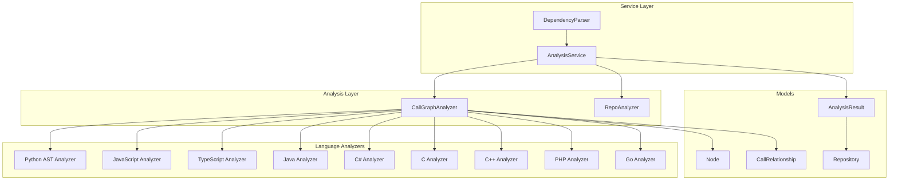
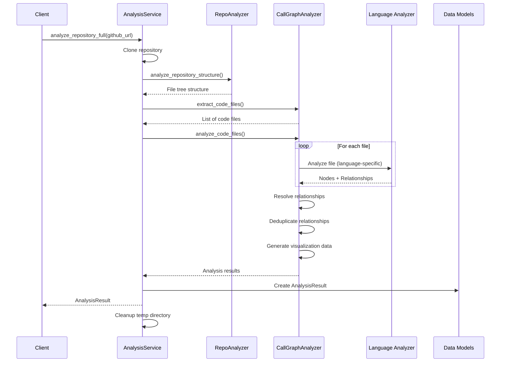

# Dependency Analyzer Module

## Overview

The **Dependency Analyzer** module is a comprehensive code analysis system that extracts structural information and dependency relationships from multi-language software repositories. It provides AST-based parsing, call graph generation, and repository structure analysis to enable deep code understanding and documentation generation.

## Purpose

The module serves as the foundation for:
- **Code Structure Analysis**: Extracting functions, classes, methods, and other code components
- **Dependency Mapping**: Identifying call relationships and dependencies between code components
- **Multi-Language Support**: Analyzing code across 9+ programming languages with language-specific parsers
- **Visualization Data Generation**: Creating graph data for interactive code exploration
- **Documentation Support**: Providing structured data for automated documentation generation

## Architecture Overview



## Core Components

### 1. Analysis Service (`AnalysisService`)

The central orchestration component that manages the complete analysis workflow.

**Key Responsibilities:**
- Repository cloning and validation
- File structure analysis with filtering
- Multi-language AST parsing coordination
- Result consolidation and cleanup

**Main Methods:**
- `analyze_repository_full()`: Complete analysis with call graph generation
- `analyze_repository_structure_only()`: Lightweight structure analysis
- `analyze_local_repository()`: Analyze local repository folders

**See:** [Analysis Service Details](analysis.md)

### 2. Call Graph Analyzer (`CallGraphAnalyzer`)

Central orchestrator for multi-language call graph analysis that coordinates language-specific analyzers.

**Key Responsibilities:**
- Routing files to appropriate language analyzers
- Building comprehensive call graphs
- Resolving and deduplicating relationships
- Generating visualization data

**Supported Languages:**
- Python (AST-based)
- JavaScript, TypeScript (Tree-sitter)
- Java, C#, C, C++, PHP, Go (Tree-sitter)

**See:** [Call Graph Analyzer Details](analysis.md)

### 3. Repository Analyzer (`RepoAnalyzer`)

Analyzes repository structures and generates detailed file tree representations.

**Key Responsibilities:**
- Building hierarchical file tree structures
- Filtering files based on include/exclude patterns
- Calculating repository statistics
- Security validation (symlink detection, path traversal prevention)

**See:** [Repository Analyzer Details](analysis.md)

### 4. Dependency Parser (`DependencyParser`)

Parser for extracting code components from multi-language repositories.

**Key Responsibilities:**
- Coordinating analysis service calls
- Building component mappings
- Processing relationships
- Saving dependency graphs

**See:** [Dependency Parser Details](ast_parser.md)

### 5. Language-Specific Analyzers

Each language has a dedicated analyzer optimized for its syntax and semantics:

| Language | Analyzer | Parsing Technology |
|----------|----------|-------------------|
| Python | `PythonASTAnalyzer` | Python AST |
| JavaScript | `TreeSitterJSAnalyzer` | Tree-sitter |
| TypeScript | `TreeSitterTSAnalyzer` | Tree-sitter |
| Java | `TreeSitterJavaAnalyzer` | Tree-sitter |
| C# | `TreeSitterCSharpAnalyzer` | Tree-sitter |
| C | `TreeSitterCAnalyzer` | Tree-sitter |
| C++ | `TreeSitterCppAnalyzer` | Tree-sitter |
| PHP | `TreeSitterPHPAnalyzer` | Tree-sitter |
| Go | `TreeSitterGoAnalyzer` | Tree-sitter |

**See:** [Language Analyzers Overview](analyzers.md)

### 6. Data Models

Core data structures for representing analysis results:

- **`Node`**: Represents a code component (function, class, method, etc.)
- **`CallRelationship`**: Represents a call relationship between components
- **`Repository`**: Repository metadata and configuration
- **`AnalysisResult`**: Complete analysis output with all components

**See:** [Data Models Details](models.md)

## Data Flow



## Integration Points

### With Documentation Generator Module

The dependency analyzer provides structured code analysis data to the [`documentation_generator`](documentation_generator.md) module:

```python
from codewiki.src.be.dependency_analyzer.analysis.analysis_service import AnalysisService

service = AnalysisService()
result = service.analyze_repository_full(github_url)
# Pass result to documentation generator
```

### With Web Application Module

The [`web_application`](web_application.md) module uses the analyzer for background processing:

- Repository analysis jobs
- Cache management for analysis results
- Real-time visualization data

### With CLI Module

The [`cli`](cli.md) module provides command-line access to analysis features:

- Local repository analysis
- Dependency graph export
- Configuration management

## Key Features

### Multi-Language Support

The module supports analysis of 9 programming languages with appropriate parsing technology for each:

- **Python**: Native AST parsing for accurate semantic analysis
- **JavaScript/TypeScript**: Tree-sitter for robust parsing of modern JS/TS features
- **Java/C#/C/C++/PHP/Go**: Tree-sitter for consistent cross-language analysis

### Call Graph Generation

Comprehensive call relationship extraction including:
- Function/method calls
- Class inheritance relationships
- Interface implementations
- Type dependencies
- Object creation relationships

### Security Features

- Path traversal prevention
- Symlink detection and rejection
- Safe file reading utilities
- Repository isolation in temp directories

### Visualization Support

Generates Cytoscape.js compatible graph data:
- Node styling by language and type
- Edge representation for call relationships
- Summary statistics for analysis results

## Configuration

### Include/Exclude Patterns

```python
from codewiki.src.be.dependency_analyzer.analysis.analysis_service import AnalysisService

service = AnalysisService()
result = service.analyze_repository_full(
    github_url="https://github.com/user/repo",
    include_patterns=["*.py", "*.js"],  # Only analyze these file types
    exclude_patterns=["*test*", "*/node_modules/*"]  # Exclude these paths
)
```

### Language Filtering

```python
result = service.analyze_local_repository(
    repo_path="/path/to/repo",
    languages=["python", "javascript"],  # Only analyze these languages
    max_files=100  # Limit number of files
)
```

## Usage Examples

### Full Repository Analysis

```python
from codewiki.src.be.dependency_analyzer.analysis.analysis_service import AnalysisService

service = AnalysisService()
result = service.analyze_repository_full(
    github_url="https://github.com/example/project"
)

print(f"Found {result.summary['total_functions']} functions")
print(f"Found {result.summary['total_calls']} call relationships")
print(f"Languages: {result.summary['languages_analyzed']}")
```

### Structure-Only Analysis

```python
service = AnalysisService()
structure = service.analyze_repository_structure_only(
    github_url="https://github.com/example/project"
)

print(f"Total files: {structure['file_summary']['total_files']}")
print(f"Total size: {structure['file_summary']['total_size_kb']} KB")
```

### Local Repository Analysis

```python
service = AnalysisService()
result = service.analyze_local_repository(
    repo_path="/path/to/local/repo",
    max_files=50,
    languages=["python"]
)

print(f"Nodes: {result['summary']['total_nodes']}")
print(f"Relationships: {result['summary']['total_relationships']}")
```

### Dependency Graph Export

```python
from codewiki.src.be.dependency_analyzer.ast_parser import DependencyParser

parser = DependencyParser(
    repo_path="/path/to/repo",
    include_patterns=["*.py"],
    exclude_patterns=["*test*"]
)

components = parser.parse_repository()
parser.save_dependency_graph("output/dependencies.json")
```

## Performance Considerations

- **File Limits**: Use `max_files` parameter for large repositories
- **Language Filtering**: Specify languages to reduce analysis time
- **Pattern Filtering**: Use include/exclude patterns to focus analysis
- **Structure-Only Mode**: Use for quick repository exploration without call graph generation

## Error Handling

The module implements comprehensive error handling:

- Syntax errors in source files are logged and skipped
- Parser initialization failures are handled gracefully
- Repository cloning failures raise clear exceptions
- Temporary directory cleanup is automatic

## Related Modules

- [Documentation Generator](documentation_generator.md) - Uses analysis results for documentation
- [Web Application](web_application.md) - Provides web interface for analysis
- [CLI](cli.md) - Command-line access to analysis features
- [Agent Tools](agent_tools.md) - Tools for code manipulation during analysis

## Future Enhancements

Planned improvements:
- Additional language support (Rust, Ruby, etc.)
- Cross-repository dependency analysis
- Enhanced type inference for dynamic languages
- Performance optimizations for large codebases
- Incremental analysis support
