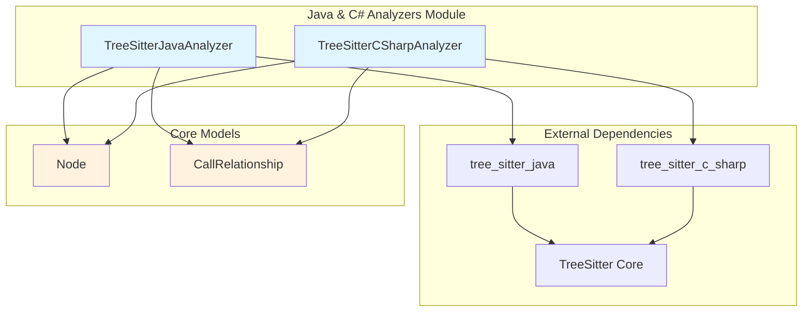
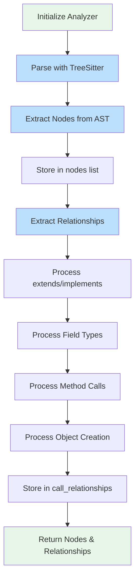
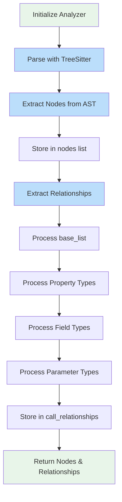
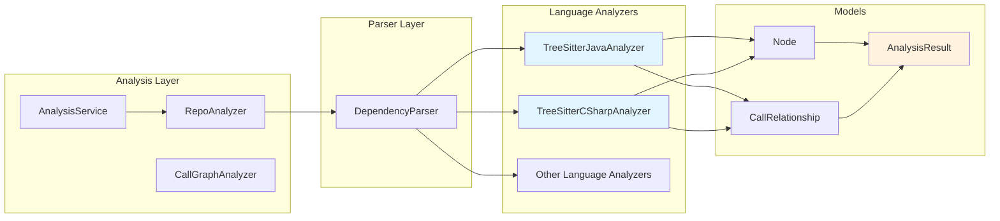

# Java & C# Analyzers Module

## Overview

The **Java & C# Analyzers** module provides language-specific static analysis capabilities for Java and C# codebases within the CodeWiki dependency analysis system. This module leverages TreeSitter parsing technology to extract structural information and dependency relationships from source code files, enabling comprehensive codebase understanding and documentation generation.

These analyzers are part of the broader [dependency_analyzer](dependency_analyzer.md) module and work alongside other language analyzers including [Python](python_analyzer.md), [JavaScript/TypeScript](javascript_typescript_analyzers.md), [C/C++](c_cpp_analyzers.md), and [PHP/Go](php_go_analyzers.md).

## Architecture



## Component Details

### TreeSitterJavaAnalyzer

**Location:** `codewiki/src/be/dependency_analyzer/analyzers/java.py`

The Java analyzer extracts structural elements and relationships from Java source files using TreeSitter's Java grammar.

#### Key Responsibilities

1. **Node Extraction**: Identifies and creates `Node` objects for:
   - Classes (including abstract classes)
   - Interfaces
   - Enums
   - Records
   - Annotations
   - Methods

2. **Relationship Extraction**: Discovers `CallRelationship` objects for:
   - Class inheritance (`extends`)
   - Interface implementation (`implements`)
   - Field type dependencies
   - Method invocations
   - Object creation expressions

#### Core Methods

| Method | Purpose |
|--------|---------|
| `__init__` | Initialize analyzer with file path, content, and optional repo path |
| `_analyze` | Main analysis orchestration method |
| `_extract_nodes` | Recursively extract code structure nodes from AST |
| `_extract_relationships` | Identify dependencies between extracted nodes |
| `_get_module_path` | Convert file path to Java module notation |
| `_get_component_id` | Generate unique component identifier |
| `_is_primitive_type` | Filter out primitive and built-in types |
| `_find_containing_class` | Locate the enclosing class for a node |
| `_find_variable_type` | Resolve variable types through scope analysis |

#### Analysis Flow



### TreeSitterCSharpAnalyzer

**Location:** `codewiki/src/be/dependency_analyzer/analyzers/csharp.py`

The C# analyzer provides similar functionality for C# codebases, adapted to C# language constructs and TreeSitter's C# grammar.

#### Key Responsibilities

1. **Node Extraction**: Identifies and creates `Node` objects for:
   - Classes (including abstract and static classes)
   - Interfaces
   - Structs
   - Enums
   - Records
   - Delegates

2. **Relationship Extraction**: Discovers `CallRelationship` objects for:
   - Class inheritance and interface implementation (via `base_list`)
   - Property type dependencies
   - Field type dependencies
   - Method parameter type dependencies

#### Core Methods

| Method | Purpose |
|--------|---------|
| `__init__` | Initialize analyzer with file path, content, and optional repo path |
| `_analyze` | Main analysis orchestration method |
| `_extract_nodes` | Recursively extract code structure nodes from AST |
| `_extract_relationships` | Identify dependencies between extracted nodes |
| `_get_module_path` | Convert file path to C# module notation |
| `_get_component_id` | Generate unique component identifier |
| `_is_primitive_type` | Filter out primitive and built-in types |
| `_find_containing_class` | Locate the enclosing class for a node |
| `_get_identifier_name_cs` | C#-specific identifier extraction |

#### Analysis Flow



## Data Models

Both analyzers produce output using shared data models from the [models](dependency_analyzer.md#models) component:

### Node

Represents a code structure element extracted from source code.

```python
Node(
    id: str,                    # Unique component identifier
    name: str,                  # Element name
    component_type: str,        # e.g., "class", "interface", "method"
    file_path: str,             # Absolute file path
    relative_path: str,         # Path relative to repo root
    source_code: str,           # Source code snippet
    start_line: int,            # Starting line number
    end_line: int,              # Ending line number
    has_docstring: bool,        # Documentation presence flag
    docstring: str,             # Documentation content
    parameters: Optional,       # Method parameters
    node_type: str,             # Type classification
    base_classes: Optional,     # Parent classes
    class_name: Optional,       # Containing class name
    display_name: str,          # Human-readable name
    component_id: str           # Unique identifier
)
```

### CallRelationship

Represents a dependency or relationship between two code elements.

```python
CallRelationship(
    caller: str,         # Source component ID
    callee: str,         # Target component ID
    call_line: int,      # Line number where relationship occurs
    is_resolved: bool    # Whether target is resolved in current analysis
)
```

## Integration with Dependency Analyzer

The Java and C# analyzers integrate with the broader [dependency_analyzer](dependency_analyzer.md) system through the following components:



### Usage Pattern

```python
from codewiki.src.be.dependency_analyzer.analyzers.java import analyze_java_file
from codewiki.src.be.dependency_analyzer.analyzers.csharp import analyze_csharp_file

# Analyze Java file
java_nodes, java_relationships = analyze_java_file(
    file_path="/path/to/File.java",
    content=java_source_code,
    repo_path="/path/to/repo"
)

# Analyze C# file
csharp_nodes, csharp_relationships = analyze_csharp_file(
    file_path="/path/to/File.cs",
    content=csharp_source_code,
    repo_path="/path/to/repo"
)
```

## Language-Specific Considerations

### Java Analyzer

| Feature | Implementation |
|---------|---------------|
| Module Path | Converts file paths to dot-notation (e.g., `com/example/Main.java` → `com.example.Main`) |
| Type Resolution | Searches method blocks and class fields for variable type declarations |
| Primitive Filtering | Excludes Java primitives and common JDK types (String, List, Map, etc.) |
| Method Calls | Tracks object.method() invocations with type resolution |

### C# Analyzer

| Feature | Implementation |
|---------|---------------|
| Module Path | Converts file paths to dot-notation (e.g., `Project/File.cs` → `Project.File`) |
| Type Resolution | Focuses on base_list, property, field, and parameter declarations |
| Primitive Filtering | Excludes C# primitives and common .NET types (String, Task, DateTime, etc.) |
| Static Classes | Identifies and labels static class declarations separately |

## Comparison Matrix

| Feature | Java Analyzer | C# Analyzer |
|---------|--------------|-------------|
| Parser Library | tree_sitter_java | tree_sitter_c_sharp |
| Class Types | class, abstract class | class, abstract class, static class |
| Type Declarations | interface, enum, record, annotation | interface, enum, record, struct, delegate |
| Inheritance Detection | `superclass` node | `base_list` node |
| Method Call Tracking | Yes (with type resolution) | No (focus on declarations) |
| Object Creation Tracking | Yes | No |
| Parameter Analysis | No | Yes |
| Property Analysis | No | Yes |

## Dependencies

### External Libraries

- **tree_sitter**: Core parsing engine
- **tree_sitter_java**: Java language grammar
- **tree_sitter_c_sharp**: C# language grammar

### Internal Dependencies

- [Node](dependency_analyzer.md#models) - Core data model for code elements
- [CallRelationship](dependency_analyzer.md#models) - Relationship data model
- [DependencyParser](dependency_analyzer.md#ast_parser) - Parser orchestration layer
- [AnalysisService](dependency_analyzer.md#analysis) - High-level analysis API

## Related Modules

- [dependency_analyzer](dependency_analyzer.md) - Parent module providing analysis infrastructure
- [python_analyzer](python_analyzer.md) - Python language analyzer
- [javascript_typescript_analyzers](javascript_typescript_analyzers.md) - JavaScript/TypeScript analyzers
- [c_cpp_analyzers](c_cpp_analyzers.md) - C/C++ analyzers
- [php_go_analyzers](php_go_analyzers.md) - PHP/Go analyzers
- [documentation_generator](documentation_generator.md) - Consumes analysis results for documentation
- [web_application](web_application.md) - Web interface for analysis jobs
- [cli](cli.md) - Command-line interface for analysis

## Error Handling

Both analyzers implement defensive programming patterns:

1. **Path Resolution**: Handles `ValueError` when computing relative paths across different drives/volumes
2. **Node Detection**: Gracefully handles missing AST nodes with `None` checks
3. **Type Resolution**: Returns `None` for unresolvable types rather than raising exceptions
4. **Logging**: Uses Python's logging module for debug-level diagnostic information

## Performance Considerations

- **Single-pass Parsing**: Each file is parsed once by TreeSitter, then traversed multiple times for node and relationship extraction
- **Recursive Traversal**: AST traversal is recursive, which may impact stack depth for deeply nested code
- **Type Resolution**: Variable type resolution involves scope searching, which adds O(n) complexity per method call
- **Memory**: All nodes and relationships are held in memory during analysis; large files may require significant memory

## Future Enhancements

Potential areas for improvement:

1. **Cross-file Resolution**: Currently `is_resolved=False` for most relationships; could integrate with repo-wide symbol table
2. **Generic Type Handling**: Enhanced support for generic type parameters and constraints
3. **Annotation Processing**: Deeper analysis of Java annotations and C# attributes
4. **Async/Aware Analysis**: Special handling for async methods and Task-based patterns in C#
5. **Documentation Extraction**: Integration with Javadoc and XML documentation comments
