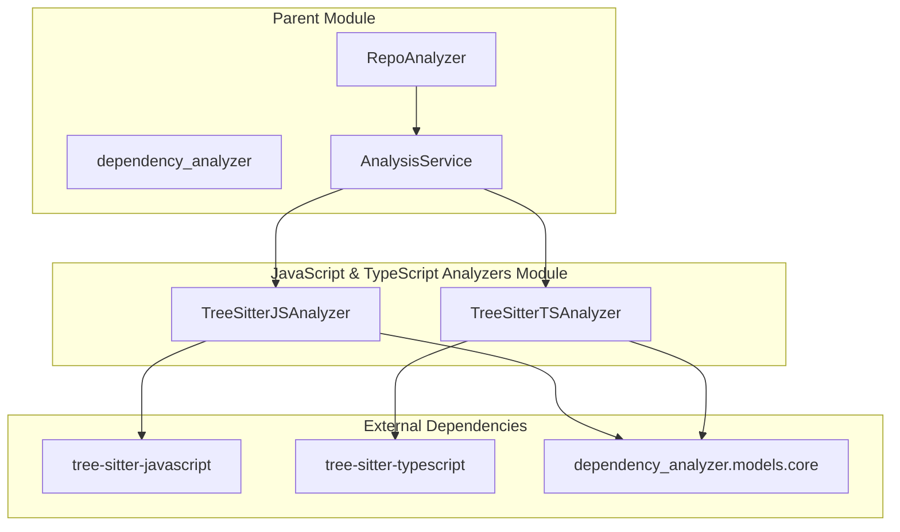
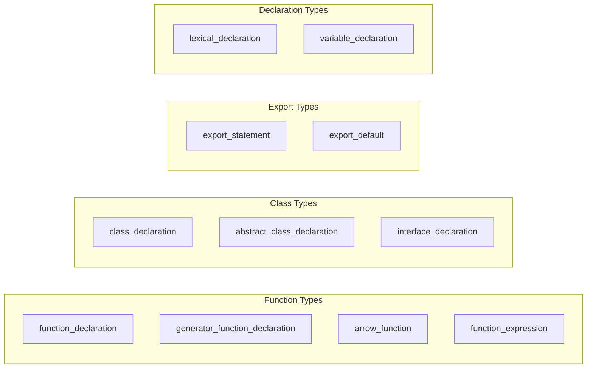
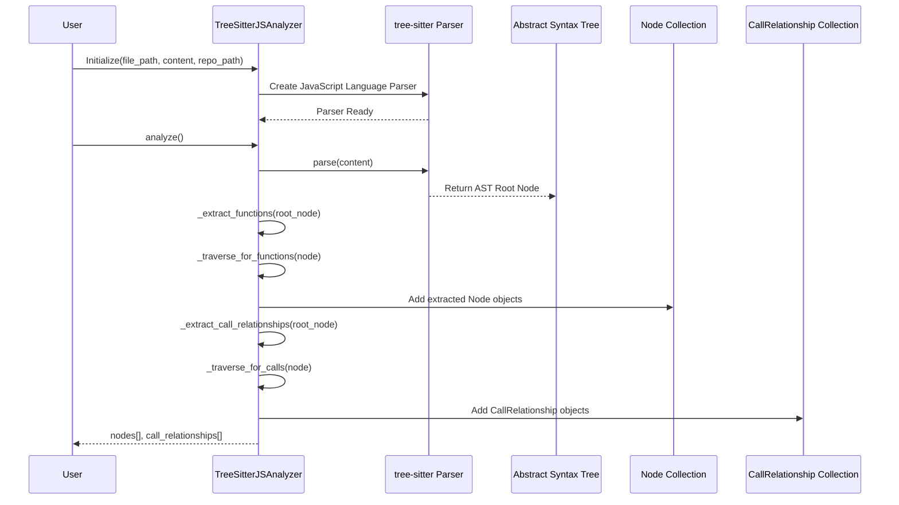
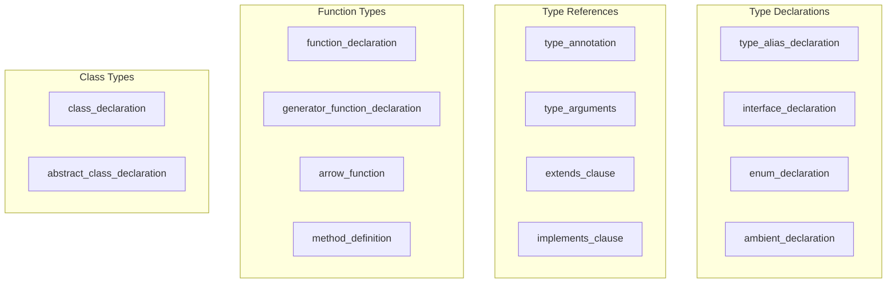
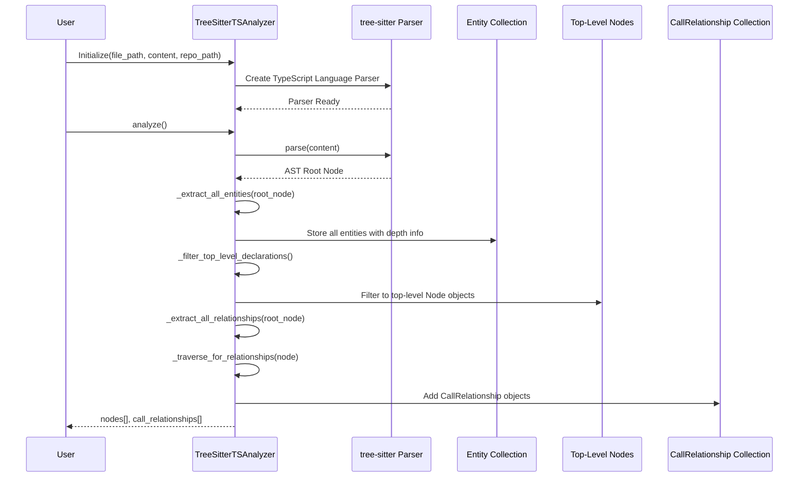
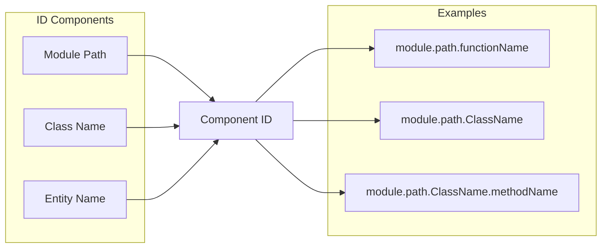
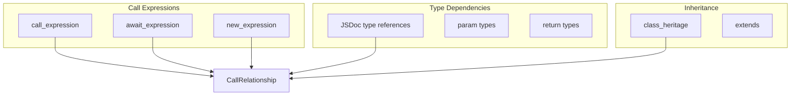
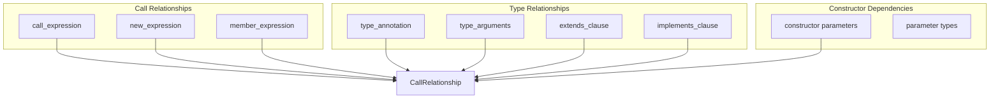
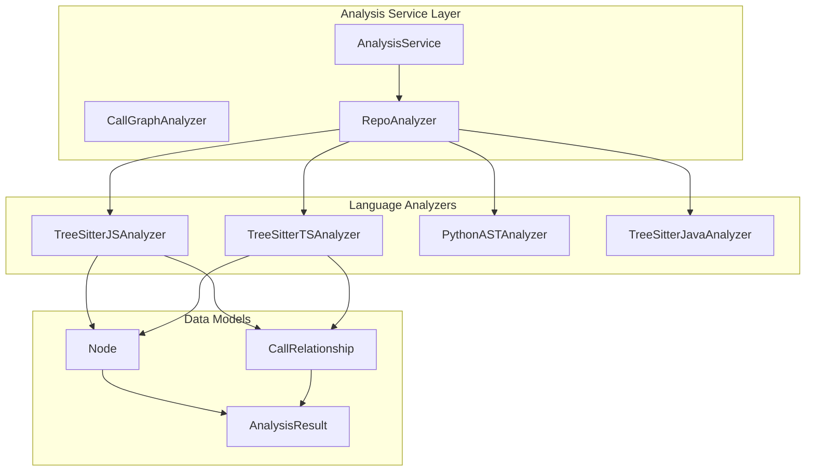
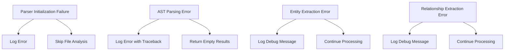

# JavaScript & TypeScript Analyzers Module

## Overview

The **javascript_typescript_analyzers** module provides specialized code analysis capabilities for JavaScript and TypeScript files within the CodeWiki dependency analysis system. This module leverages tree-sitter parsing technology to extract structural information, identify code entities, and map call relationships in JavaScript/TypeScript codebases.

As a child module of the [dependency_analyzer](dependency_analyzer.md) system, it works alongside other language-specific analyzers ([python_analyzer](python_analyzer.md), [java_csharp_analyzers](java_csharp_analyzers.md), [c_cpp_analyzers](c_cpp_analyzers.md), [php_go_analyzers](php_go_analyzers.md)) to provide comprehensive multi-language code analysis.

## Core Components

| Component | File | Purpose |
|-----------|------|---------|
| `TreeSitterJSAnalyzer` | `javascript.py` | Analyzes JavaScript files (.js, .jsx, .mjs, .cjs) |
| `TreeSitterTSAnalyzer` | `typescript.py` | Analyzes TypeScript files (.ts, .tsx) |

## Architecture



## Component Details

### TreeSitterJSAnalyzer

The JavaScript analyzer extracts code entities and relationships from JavaScript source files.

#### Key Capabilities

- **Entity Extraction**: Identifies functions, classes, methods, interfaces, and exported components
- **Call Relationship Mapping**: Tracks function calls, method invocations, and constructor usage
- **JSDoc Type Analysis**: Extracts type dependencies from JSDoc comments
- **Class Hierarchy Detection**: Identifies inheritance and class relationships

#### Supported JavaScript Constructs



#### Analysis Flow



### TreeSitterTSAnalyzer

The TypeScript analyzer extends JavaScript analysis with TypeScript-specific features including type annotations, interfaces, and type aliases.

#### Key Capabilities

- **TypeScript-Specific Entities**: Extracts type aliases, interfaces, enums, and ambient declarations
- **Type Annotation Analysis**: Maps type dependencies from annotations and generics
- **Constructor Dependency Extraction**: Identifies dependencies from constructor parameter types
- **Enhanced Export Handling**: Processes TypeScript-specific export patterns

#### Supported TypeScript Constructs



#### Analysis Flow



## Data Models

### Node Structure

Both analyzers produce `Node` objects (defined in [dependency_analyzer.models.core](dependency_analyzer.md)) with the following structure:

```python
Node(
    id: str,                    # Unique component identifier
    name: str,                  # Entity name
    component_type: str,        # e.g., "function", "class", "method", "interface"
    file_path: str,             # Absolute file path
    relative_path: str,         # Path relative to repo root
    source_code: str,           # Source code snippet
    start_line: int,            # Starting line number
    end_line: int,              # Ending line number
    has_docstring: bool,        # Whether documentation exists
    docstring: str,             # Documentation content
    parameters: List[str],      # Function/method parameters
    node_type: str,             # Specific type (e.g., "arrow_function")
    base_classes: List[str],    # Inherited classes/interfaces
    class_name: str,            # Parent class (for methods)
    display_name: str           # Human-readable name
)
```

### CallRelationship Structure

Call relationships track dependencies between code entities:

```python
CallRelationship(
    caller: str,        # Component ID of the calling entity
    callee: str,        # Component ID of the called entity
    call_line: int,     # Line number where call occurs
    is_resolved: bool   # Whether callee is found in analyzed nodes
)
```

## Component ID Generation

Both analyzers generate unique component IDs using a consistent naming convention:



**Module Path Calculation:**
- Converts file path to dot notation (e.g., `src/utils/helpers.js` → `src.utils.helpers`)
- Removes file extensions (.js, .ts, .jsx, .tsx, .mjs, .cjs)
- Relative to repository root when `repo_path` is provided

## Relationship Detection

### JavaScript Relationship Types



### TypeScript Relationship Types



## Integration with Dependency Analyzer

The JavaScript and TypeScript analyzers integrate with the broader [dependency_analyzer](dependency_analyzer.md) system:



### Usage in Analysis Pipeline

1. **File Detection**: [RepoAnalyzer](dependency_analyzer.md) identifies JavaScript/TypeScript files by extension
2. **Analyzer Selection**: Routes files to appropriate analyzer based on file type
3. **Analysis Execution**: Analyzer processes file content and extracts entities/relationships
4. **Result Aggregation**: [AnalysisService](dependency_analyzer.md) combines results from all analyzers
5. **Graph Construction**: [DependencyGraphBuilder](documentation_generator.md) builds dependency graph from results

## Built-in Type Filtering

Both analyzers filter out built-in types to reduce noise in dependency graphs:

### JavaScript Built-in Types
- **Primitives**: `string`, `number`, `boolean`, `object`, `undefined`, `null`, `void`, `any`
- **Global Objects**: `Array`, `Promise`, `Date`, `RegExp`, `Error`, `Map`, `Set`, `Function`, `Object`
- **Web APIs**: `Element`, `HTMLElement`, `Document`, `Window`, `Event`, `Response`, `Request`
- **Generic Parameters**: `T`, `U`, `V`, `K`, `P`, `R`, `E`

### TypeScript Built-in Types
- **All JavaScript types** (listed above)
- **TypeScript-specific**: `never`, `unknown`

## Error Handling

Both analyzers implement robust error handling:



## API Reference

### TreeSitterJSAnalyzer

#### Constructor
```python
TreeSitterJSAnalyzer(
    file_path: str,      # Path to JavaScript file
    content: str,        # File content as string
    repo_path: str = None  # Optional repository root path
)
```

#### Methods
- `analyze() -> None`: Main analysis entry point
- `_extract_functions(node) -> None`: Extract function/class declarations
- `_extract_call_relationships(node) -> None`: Extract call relationships
- `_extract_jsdoc_type_dependencies(node, caller_name) -> None`: Extract JSDoc type references

### TreeSitterTSAnalyzer

#### Constructor
```python
TreeSitterTSAnalyzer(
    file_path: str,      # Path to TypeScript file
    content: str,        # File content as string
    repo_path: str = None  # Optional repository root path
)
```

#### Methods
- `analyze() -> None`: Main analysis entry point
- `_extract_all_entities(node, all_entities) -> None`: Extract all code entities
- `_filter_top_level_declarations(all_entities) -> None`: Filter to top-level declarations
- `_extract_all_relationships(node, all_entities) -> None`: Extract all relationships
- `_extract_constructor_dependencies(class_node, class_name) -> None`: Extract constructor parameter dependencies

### Helper Functions

```python
analyze_javascript_file_treesitter(
    file_path: str,
    content: str,
    repo_path: str = None
) -> Tuple[List[Node], List[CallRelationship]]

analyze_typescript_file_treesitter(
    file_path: str,
    content: str,
    repo_path: str = None
) -> Tuple[List[Node], List[CallRelationship]]
```

## Configuration

### Supported File Extensions

| Analyzer | Extensions |
|----------|-----------|
| TreeSitterJSAnalyzer | `.js`, `.jsx`, `.mjs`, `.cjs` |
| TreeSitterTSAnalyzer | `.ts`, `.tsx` |

### Parser Initialization

Both analyzers require tree-sitter language packages:
- `tree-sitter-javascript` for JavaScript analysis
- `tree-sitter-typescript` for TypeScript analysis

## Performance Considerations

- **AST Parsing**: Tree-sitter provides efficient incremental parsing
- **Relationship Deduplication**: JavaScript analyzer uses `seen_relationships` set to prevent duplicates
- **Depth Tracking**: TypeScript analyzer tracks entity depth to filter nested declarations
- **Lazy Loading**: Parsers initialized on-demand per file

## Limitations

1. **Dynamic Imports**: Cannot resolve dynamically imported modules
2. **Runtime Types**: TypeScript type relationships are static analysis only
3. **JSDoc Completeness**: Depends on presence and accuracy of JSDoc comments
4. **Module Resolution**: Does not resolve cross-file imports (handled at higher level)
5. **Minified Code**: Not optimized for minified or obfuscated code

## Related Modules

- [dependency_analyzer](dependency_analyzer.md): Parent module providing analysis orchestration
- [python_analyzer](python_analyzer.md): Python code analysis using AST
- [java_csharp_analyzers](java_csharp_analyzers.md): Java and C# analysis
- [documentation_generator](documentation_generator.md): Uses analysis results for documentation generation
- [web_application](web_application.md): Web interface for analysis results
- [cli](cli.md): Command-line interface for analysis

## Example Usage

```python
from codewiki.src.be.dependency_analyzer.analyzers.javascript import TreeSitterJSAnalyzer
from codewiki.src.be.dependency_analyzer.analyzers.typescript import TreeSitterTSAnalyzer

# Analyze JavaScript file
js_content = """
class UserService {
    async getUser(id) {
        return await db.query(id);
    }
}
"""

js_analyzer = TreeSitterJSAnalyzer(
    file_path="src/services/user.js",
    content=js_content,
    repo_path="/path/to/repo"
)
js_analyzer.analyze()

print(f"Found {len(js_analyzer.nodes)} nodes")
print(f"Found {len(js_analyzer.call_relationships)} relationships")

# Analyze TypeScript file
ts_content = """
interface IUser {
    id: number;
    name: string;
}

class UserService implements IUser {
    constructor(private db: Database) {}
    
    async getUser(id: number): Promise<IUser> {
        return await this.db.query(id);
    }
}
"""

ts_analyzer = TreeSitterTSAnalyzer(
    file_path="src/services/user.ts",
    content=ts_content,
    repo_path="/path/to/repo"
)
ts_analyzer.analyze()

print(f"Found {len(ts_analyzer.nodes)} nodes")
print(f"Found {len(ts_analyzer.call_relationships)} relationships")
```

## Testing Considerations

When testing these analyzers:
1. Test with various JavaScript/TypeScript syntax patterns
2. Verify correct handling of ES6+ features (async/await, arrow functions, classes)
3. Test TypeScript-specific features (interfaces, type aliases, generics)
4. Validate component ID generation consistency
5. Test error handling with malformed code
6. Verify built-in type filtering works correctly
