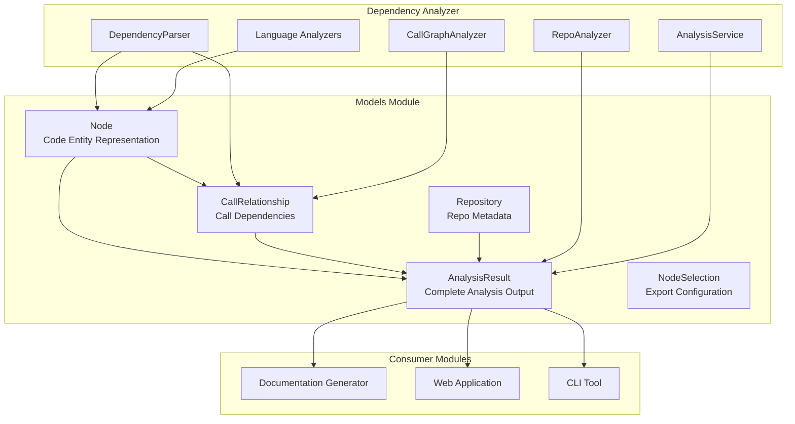
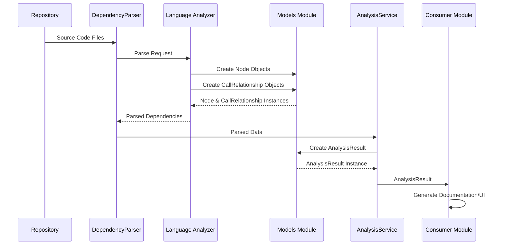
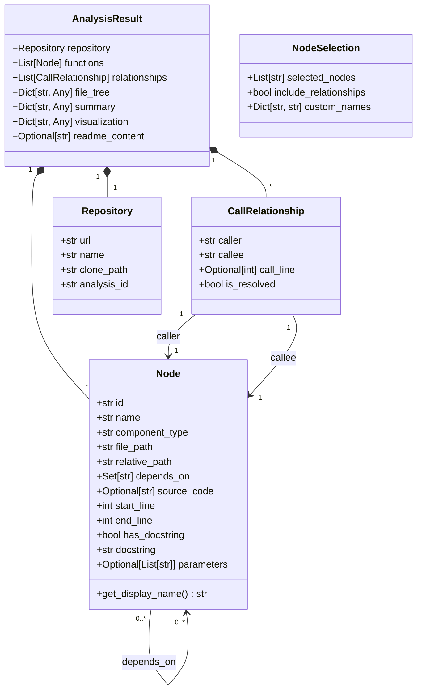

# Models Module Documentation

## Introduction

The **Models Module** serves as the foundational data layer for the CodeWiki dependency analysis system. It defines the core data structures that represent code entities, their relationships, and analysis results throughout the entire documentation generation pipeline.

This module provides Pydantic-based models that ensure data consistency, validation, and serialization across all components of the system, from code parsing to documentation generation.

## Architecture Overview



## Core Components

### 1. Node

**Purpose:** Represents a single code entity (function, class, method, etc.) within the analyzed repository.

**File:** `codewiki/src/be/dependency_analyzer/models/core.py`

**Attributes:**

| Attribute | Type | Description |
|-----------|------|-------------|
| `id` | `str` | Unique identifier for the node |
| `name` | `str` | Name of the code entity |
| `component_type` | `str` | Type of component (function, class, method, etc.) |
| `file_path` | `str` | Absolute file path where the entity is defined |
| `relative_path` | `str` | Path relative to repository root |
| `depends_on` | `Set[str]` | Set of node IDs this node depends on |
| `source_code` | `Optional[str]` | The actual source code of the entity |
| `start_line` | `int` | Starting line number in the file |
| `end_line` | `int` | Ending line number in the file |
| `has_docstring` | `bool` | Whether the entity has documentation |
| `docstring` | `str` | The docstring content if available |
| `parameters` | `Optional[List[str]]` | List of parameter names |
| `node_type` | `Optional[str]` | Specific type classification |
| `base_classes` | `Optional[List[str]]` | Base classes for class entities |
| `class_name` | `Optional[str]` | Parent class name for methods |
| `display_name` | `Optional[str]` | Custom display name for UI |
| `component_id` | `Optional[str]` | Alternative component identifier |

**Methods:**

- `get_display_name() -> str`: Returns the display name or falls back to the node name

**Usage Example:**

```python
from codewiki.src.be.dependency_analyzer.models.core import Node

function_node = Node(
    id="func_001",
    name="process_data",
    component_type="function",
    file_path="/repo/src/utils.py",
    relative_path="src/utils.py",
    start_line=10,
    end_line=25,
    has_docstring=True,
    docstring="Process incoming data and return results",
    parameters=["data", "options"]
)
```

### 2. CallRelationship

**Purpose:** Represents a call relationship between two code entities, capturing the dependency structure of the codebase.

**File:** `codewiki/src/be/dependency_analyzer/models/core.py`

**Attributes:**

| Attribute | Type | Description |
|-----------|------|-------------|
| `caller` | `str` | Node ID of the calling entity |
| `callee` | `str` | Node ID of the called entity |
| `call_line` | `Optional[int]` | Line number where the call occurs |
| `is_resolved` | `bool` | Whether the callee was successfully resolved |

**Usage Example:**

```python
from codewiki.src.be.dependency_analyzer.models.core import CallRelationship

call_rel = CallRelationship(
    caller="func_001",
    callee="func_002",
    call_line=15,
    is_resolved=True
)
```

### 3. Repository

**Purpose:** Stores metadata about the analyzed repository.

**File:** `codewiki/src/be/dependency_analyzer/models/core.py`

**Attributes:**

| Attribute | Type | Description |
|-----------|------|-------------|
| `url` | `str` | Repository URL (e.g., GitHub URL) |
| `name` | `str` | Repository name |
| `clone_path` | `str` | Local path where repository is cloned |
| `analysis_id` | `str` | Unique identifier for this analysis run |

### 4. AnalysisResult

**Purpose:** Encapsulates the complete output of a repository analysis, serving as the primary data structure passed between system components.

**File:** `codewiki/src/be/dependency_analyzer/models/analysis.py`

**Attributes:**

| Attribute | Type | Description |
|-----------|------|-------------|
| `repository` | `Repository` | Repository metadata |
| `functions` | `List[Node]` | All analyzed code entities |
| `relationships` | `List[CallRelationship]` | All call relationships discovered |
| `file_tree` | `Dict[str, Any]` | Hierarchical file structure of the repository |
| `summary` | `Dict[str, Any]` | Analysis statistics and summary data |
| `visualization` | `Dict[str, Any]` | Data for generating visual representations |
| `readme_content` | `Optional[str]` | Repository README content if available |

**Usage Example:**

```python
from codewiki.src.be.dependency_analyzer.models.analysis import AnalysisResult

result = AnalysisResult(
    repository=repo_metadata,
    functions=[node1, node2, node3],
    relationships=[rel1, rel2],
    file_tree={"src": {"utils.py": {...}}},
    summary={"total_functions": 150, "total_calls": 500},
    visualization={"nodes": [...], "edges": [...]}
)
```

### 5. NodeSelection

**Purpose:** Configuration for selecting specific nodes for partial export or focused documentation generation.

**File:** `codewiki/src/be/dependency_analyzer/models/analysis.py`

**Attributes:**

| Attribute | Type | Description |
|-----------|------|-------------|
| `selected_nodes` | `List[str]` | List of node IDs to include |
| `include_relationships` | `bool` | Whether to include call relationships |
| `custom_names` | `Dict[str, str]` | Custom display names for selected nodes |

## Data Flow



## Component Relationships



## Integration with Other Modules

### Dependency Analyzer Module

The models module is tightly integrated with the [Dependency Analyzer](dependency_analyzer.md) module:

- **Analyzers** (Python, JavaScript, TypeScript, Java, etc.) create `Node` and `CallRelationship` objects
- **DependencyParser** uses these models to structure parsed output
- **CallGraphAnalyzer** builds call graphs using `CallRelationship` instances
- **RepoAnalyzer** aggregates data into `AnalysisResult` objects
- **AnalysisService** orchestrates the analysis pipeline using these models

### Documentation Generator Module

The [Documentation Generator](documentation_generator.md) module consumes `AnalysisResult` objects:

- Extracts `Node` information for API documentation
- Uses `CallRelationship` data for dependency diagrams
- Leverages `file_tree` for navigation structure
- Utilizes `visualization` data for interactive graphs

### Web Application Module

The [Web Application](web_application.md) module uses models for:

- Displaying analysis results in the UI
- Caching `AnalysisResult` objects via `CacheManager`
- Tracking job status with `JobStatus` that references analysis IDs
- Processing generation options that may include `NodeSelection`

### CLI Module

The [CLI](cli.md) tool utilizes models for:

- Creating `DocumentationJob` instances with `AnalysisResult` data
- Managing configuration that affects model serialization
- Tracking progress based on node counts from `AnalysisResult.summary`

## Model Validation

All models use Pydantic for automatic validation:

```python
from pydantic import ValidationError
from codewiki.src.be.dependency_analyzer.models.core import Node

try:
    # This will validate all required fields
    node = Node(
        id="valid_id",
        name="valid_name",
        component_type="function",
        file_path="/path/to/file.py",
        relative_path="file.py"
    )
except ValidationError as e:
    print(f"Validation error: {e}")
```

## Serialization and Deserialization

Models support JSON serialization for storage and transmission:

```python
# Serialize to JSON
json_data = analysis_result.model_dump_json()

# Deserialize from JSON
restored_result = AnalysisResult.model_validate_json(json_data)

# Dictionary format
dict_data = analysis_result.model_dump()
```

## Best Practices

### 1. Node ID Generation

Ensure unique and consistent node IDs across the codebase:

```python
# Recommended format: {file_path}:{line_number}:{name}
node_id = f"{relative_path}:{start_line}:{name}"
```

### 2. Relationship Resolution

Always mark relationships with `is_resolved` flag to indicate whether the callee was found:

```python
# Resolved relationship
CallRelationship(caller="func_1", callee="func_2", is_resolved=True)

# Unresolved (external or missing)
CallRelationship(caller="func_1", callee="external_func", is_resolved=False)
```

### 3. Memory Efficiency

For large repositories, consider:

- Using `NodeSelection` to limit exported nodes
- Streaming `AnalysisResult` components instead of loading all at once
- Clearing `source_code` field if not needed for documentation

### 4. Extensibility

When extending models:

- Add optional fields with default values for backward compatibility
- Use `Optional` type hints for new fields
- Update serialization logic if custom encoding is needed

## Error Handling

Common scenarios and handling:

```python
from codewiki.src.be.dependency_analyzer.models.core import Node, CallRelationship
from codewiki.src.be.dependency_analyzer.models.analysis import AnalysisResult

# Handle missing docstrings
node = Node(
    id="func_1",
    name="func",
    component_type="function",
    file_path="/file.py",
    relative_path="file.py",
    has_docstring=False,  # Explicitly mark as no docstring
    docstring=""  # Empty string, not None
)

# Handle unresolved calls
relationship = CallRelationship(
    caller="func_1",
    callee="unknown_func",
    is_resolved=False  # Mark as unresolved
)

# Handle partial analysis results
result = AnalysisResult(
    repository=repo,
    functions=nodes,
    relationships=relationships,
    file_tree={},  # Empty if not generated
    summary={"status": "partial"},
    visualization={}  # Empty if not generated
)
```

## Performance Considerations

1. **Large Repositories**: `AnalysisResult` can become large; consider pagination or filtering
2. **Node Dependencies**: The `depends_on` set should use node IDs for efficient lookups
3. **Serialization**: Use `model_dump(exclude={'source_code'})` to reduce payload size
4. **Caching**: Cache `AnalysisResult` objects to avoid re-analysis

## Future Enhancements

Potential model extensions:

- Add version tracking for nodes across repository history
- Include code complexity metrics in `Node`
- Add test coverage information
- Support for multi-language projects in single `AnalysisResult`
- Incremental analysis support with change tracking

## Related Documentation

- [Dependency Analyzer Module](dependency_analyzer.md) - Core analysis components
- [Documentation Generator Module](documentation_generator.md) - Documentation generation
- [Web Application Module](web_application.md) - Web interface
- [CLI Module](cli.md) - Command-line interface
