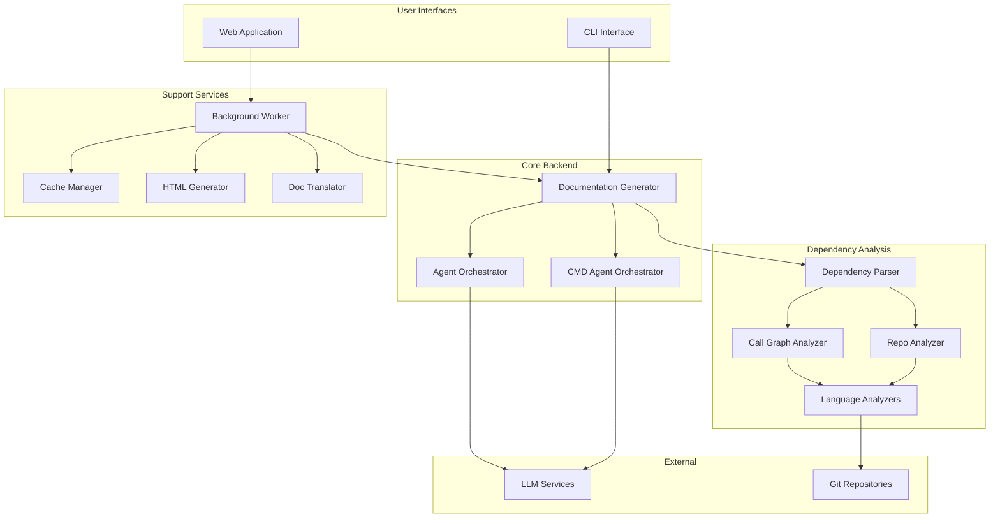
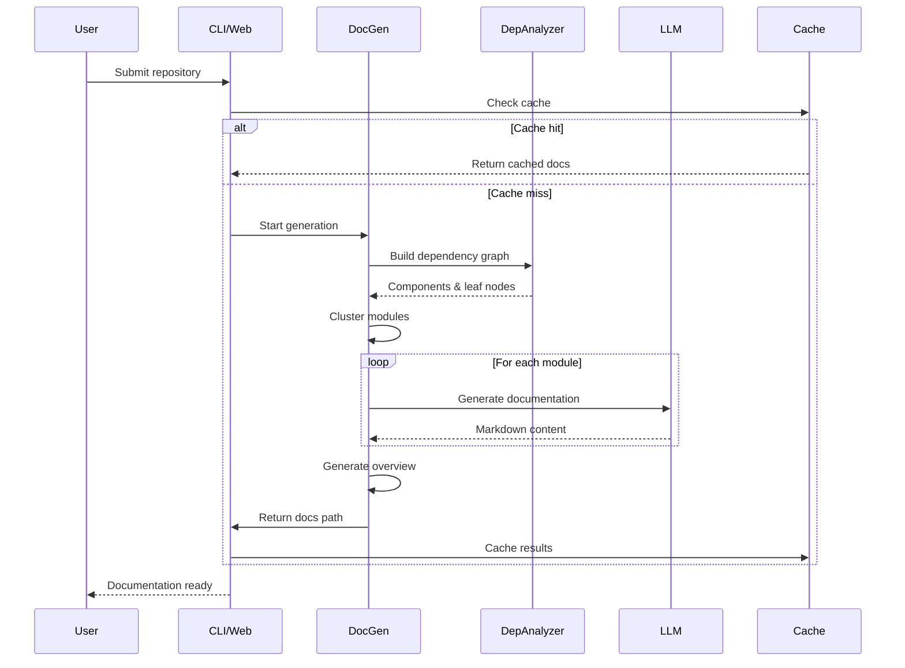

# CodeWiki - Automated Code Documentation Generator

## Overview

CodeWiki is an intelligent documentation generation system that automatically analyzes code repositories and generates comprehensive documentation using Large Language Models (LLMs). It supports multiple programming languages and provides both CLI and web application interfaces.

## Architecture Overview



## Core Functionality

### 1. Repository Analysis
- **Multi-language Support**: Python, JavaScript, TypeScript, Java, C#, C, C++, PHP, Go
- **AST Parsing**: Language-specific analyzers using tree-sitter and native AST parsers
- **Call Graph Generation**: Builds comprehensive function/method call relationships
- **Dependency Detection**: Identifies class inheritance, imports, and type dependencies

### 2. Module Clustering
- Groups related components into logical modules
- Configurable depth and token limits
- Optimizes for LLM context window constraints

### 3. Documentation Generation
- **LLM-Powered**: Uses configurable LLM models with fallback support
- **CLI Agent Mode**: Supports external CLI agents (e.g., Claude CLI) for unlimited context
- **Hierarchical Approach**: Leaf modules → Parent modules → Repository overview
- **Custom Instructions**: User-configurable documentation focus and style

### 4. Output & Distribution
- **Markdown Documentation**: Structured .md files with Mermaid diagrams
- **HTML Viewer**: Static HTML generator for GitHub Pages
- **Translation Support**: Multi-language documentation translation
- **Caching**: Efficient cache management for repeated analyses

## System Components

| Component | Description | Documentation |
|-----------|-------------|---------------|
| **Dependency Analyzer** | Multi-language code analysis and call graph generation | [dependency_analyzer.md](dependency_analyzer.md) |
| **Documentation Generator** | Main orchestration for documentation generation | [documentation_generator.md](documentation_generator.md) |
| **Web Application** | FastAPI-based web interface with job queue | [web_application.md](web_application.md) |
| **CLI** | Command-line interface for local documentation generation | [cli.md](cli.md) |
| **Agent Tools** | LLM agent tools for file editing and code reading | [agent_tools.md](agent_tools.md) |

## Key Data Models

### Node
Represents a code component (function, class, method, etc.)
- `id`: Unique component identifier
- `name`: Component name
- `component_type`: Type (function, class, method, etc.)
- `file_path`: Source file location
- `source_code`: Code snippet
- `depends_on`: Set of dependency component IDs

### CallRelationship
Represents a function/method call relationship
- `caller`: Calling component ID
- `callee`: Called component ID
- `call_line`: Line number of the call
- `is_resolved`: Whether callee is found in the codebase

### DocumentationJob
Tracks documentation generation jobs
- `job_id`: Unique job identifier
- `repository_path`: Source repository path
- `status`: Job status (pending, running, completed, failed)
- `statistics`: Analysis statistics

## Configuration

### LLM Configuration
```python
Config(
    llm_base_url="http://api.example.com",
    llm_api_key="sk-xxx",
    main_model="claude-sonnet-4",
    cluster_model="claude-sonnet-4",
    fallback_models=["fallback-model-1", "fallback-model-2"],
    max_tokens=32768,
    agent_cmd="claude --dangerously-skip-permissions -p"  # Optional CLI agent
)
```

### Agent Instructions
```python
AgentInstructions(
    include_patterns=["*.py", "*.js"],
    exclude_patterns=["*test*", "*Tests*"],
    focus_modules=["src/core", "src/api"],
    doc_type="api",  # api, architecture, user-guide, developer
    custom_instructions="Focus on API endpoints and usage examples"
)
```

## Workflow



## Supported Languages

| Language | Analyzer | Features |
|----------|----------|----------|
| Python | AST Parser | Functions, classes, methods, decorators |
| JavaScript | tree-sitter | Functions, classes, exports, JSDoc types |
| TypeScript | tree-sitter | Types, interfaces, generics, type annotations |
| Java | tree-sitter | Classes, interfaces, methods, inheritance |
| C# | tree-sitter | Classes, structs, methods, properties |
| C | tree-sitter | Functions, structs, global variables |
| C++ | tree-sitter | Classes, methods, templates, inheritance |
| PHP | tree-sitter | Classes, interfaces, traits, namespaces |
| Go | tree-sitter | Functions, methods, structs, interfaces |

## File Structure

```
codewiki/
├── src/
│   ├── be/                      # Backend
│   │   ├── dependency_analyzer/ # Code analysis
│   │   ├── agent_tools/         # LLM agent tools
│   │   ├── documentation_generator.py
│   │   ├── agent_orchestrator.py
│   │   └── cmd_agent_orchestrator.py
│   ├── fe/                      # Frontend (Web App)
│   │   ├── background_worker.py
│   │   ├── cache_manager.py
│   │   ├── routes.py
│   │   └── github_processor.py
│   └── utils.py                 # File utilities
├── cli/                         # Command-line Interface
│   ├── adapters/
│   ├── models/
│   ├── utils/
│   └── html_generator.py
└── config.py                    # Configuration
```

## Quick Start

### CLI Usage
```bash
# Configure
codewiki config set --api-key sk-xxx --base-url http://api.example.com

# Generate documentation
codewiki generate /path/to/repo --output ./docs

# With options
codewiki generate /path/to/repo \
    --output ./docs \
    --doc-type api \
    --exclude "*test*" \
    --output-lang zh
```

### Web Application
```bash
# Start server
python -m codewiki.src.fe.main --host 0.0.0.0 --port 8000

# Access at http://localhost:8000
```

### API Usage
```python
from codewiki.src.be.documentation_generator import DocumentationGenerator
from codewiki.src.config import Config

config = Config.from_cli(
    repo_path="/path/to/repo",
    output_dir="./docs",
    llm_base_url="http://api.example.com",
    llm_api_key="sk-xxx",
    main_model="claude-sonnet-4",
    cluster_model="claude-sonnet-4"
)

generator = DocumentationGenerator(config)
await generator.run()
```

## Advanced Features

### CLI Agent Mode
Use external CLI agents for unlimited context windows:
```python
config.agent_cmd = "claude --dangerously-skip-permissions -p"
```

### Translation Support
Generate documentation in multiple languages:
```bash
codewiki generate /path/to/repo --output-lang zh
```

### GitHub Pages Integration
Generate static HTML viewer:
```bash
codewiki generate /path/to/repo --github-pages
```

### Concurrent Processing
Control parallel module processing:
```bash
codewiki generate /path/to/repo --concurrency 4
```

## Monitoring & Logging

CodeWiki includes comprehensive logging with colored output:
- **DEBUG**: Development and debugging information (cyan)
- **INFO**: Normal operational messages (green)
- **WARNING**: Warning messages (yellow)
- **ERROR**: Error messages (red)
- **CRITICAL**: Critical issues (bright red)

## Error Handling

- **Fallback Models**: Automatic fallback to secondary LLM models
- **Retry Logic**: Configurable retry with cooldown periods
- **Cache Recovery**: Job status reconstruction from cache
- **Graceful Degradation**: Continues processing on non-critical errors

## Security Considerations

- **Path Validation**: Safe path handling to prevent directory traversal
- **API Key Management**: Secure storage via system keychain or environment variables
- **Repository Validation**: URL validation for git repositories
- **Symlink Protection**: Prevents symlink-based path escapes

## Performance Optimization

- **Caching**: 365-day cache expiry for analyzed repositories
- **Concurrency**: Configurable parallel processing (default: 4)
- **Token Limits**: Configurable max tokens per module/leaf module
- **Lazy Loading**: Components loaded on-demand during generation

## Related Documentation

- [Dependency Analyzer](dependency_analyzer.md) - Code analysis and call graph generation
- [Documentation Generator](documentation_generator.md) - Main generation orchestration
- [Web Application](web_application.md) - FastAPI web interface
- [CLI](cli.md) - Command-line interface
- [Agent Tools](agent_tools.md) - LLM agent tools and utilities
