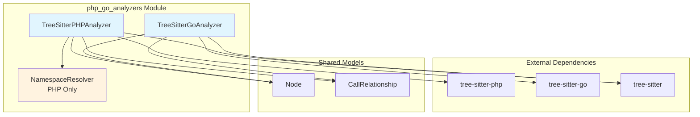
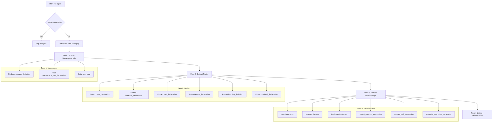
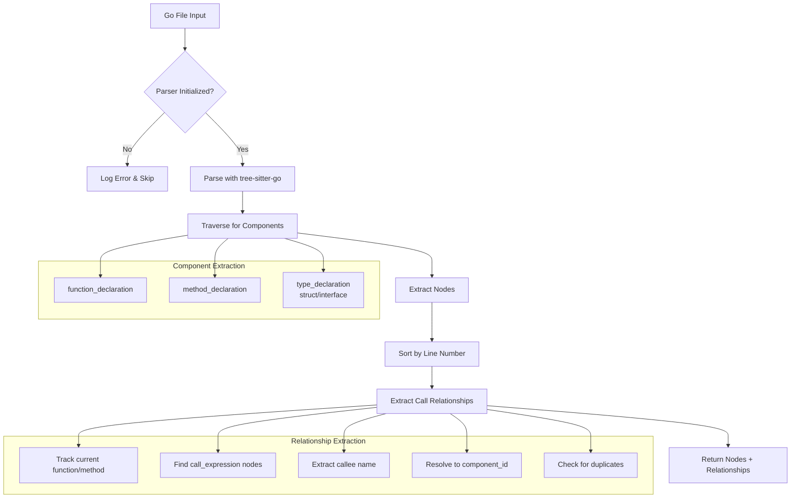
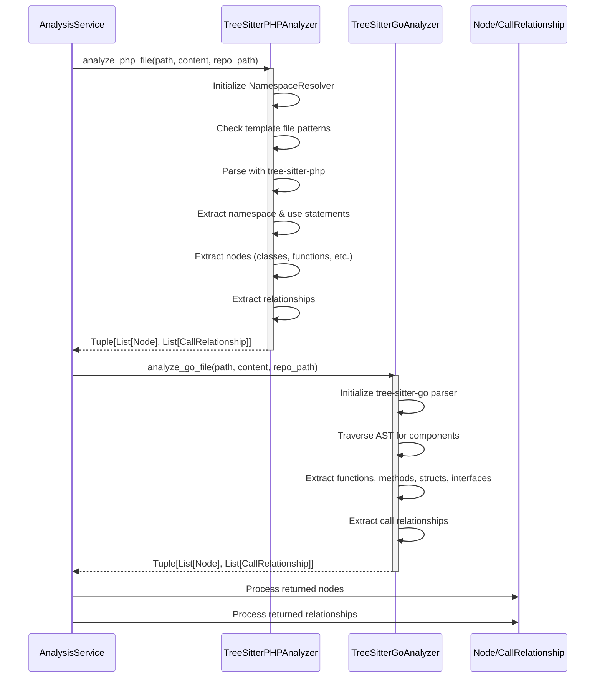
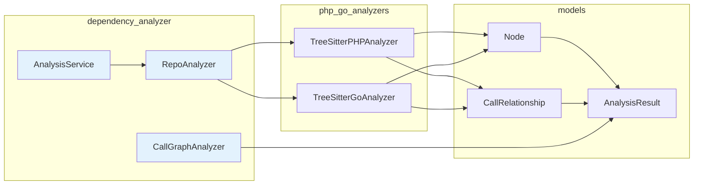

# PHP & Go Analyzers Module

## Overview

The **php_go_analyzers** module provides language-specific code analysis capabilities for PHP and Go programming languages within the CodeWiki dependency analysis system. This module contains two specialized analyzers that leverage tree-sitter parsing to extract code structure, components, and dependency relationships from PHP and Go source files.

These analyzers are part of the broader [dependency_analyzer](dependency_analyzer.md) module's analyzer ecosystem, which supports multiple programming languages through a unified interface.

## Core Components

| Component | File | Purpose |
|-----------|------|---------|
| `TreeSitterPHPAnalyzer` | `codewiki/src/be/dependency_analyzer/analyzers/php.py` | Analyzes PHP files to extract classes, interfaces, traits, enums, functions, methods, and their relationships |
| `TreeSitterGoAnalyzer` | `codewiki/src/be/dependency_analyzer/analyzers/go.py` | Analyzes Go files to extract functions, methods, structs, interfaces, and call relationships |

## Architecture



## Component Details

### TreeSitterPHPAnalyzer

The PHP analyzer extracts comprehensive code structure from PHP files including:

**Extractable Components:**
- Classes (including abstract classes)
- Interfaces
- Traits
- Enums
- Functions
- Methods

**Dependency Relationships:**
- `use` statements (namespace imports)
- `extends` (class inheritance)
- `implements` (interface implementation)
- `new` expressions (object instantiation)
- Static method calls (`::`)
- Property promotion types (PHP 8+)

**Special Features:**
- **Namespace Resolution**: Handles PHP namespaces and use statement aliases through the `NamespaceResolver` class
- **Template Detection**: Automatically skips template files (Blade, Twig, PHTML) to avoid false positives
- **Docstring Extraction**: Captures PHPDoc comments preceding code elements
- **Parameter Extraction**: Extracts function/method parameters with type hints



### TreeSitterGoAnalyzer

The Go analyzer extracts code structure from Go files including:

**Extractable Components:**
- Functions (top-level and package-level)
- Methods (with receiver type tracking)
- Structs
- Interfaces

**Dependency Relationships:**
- Function calls (direct and selector expressions)
- Method calls on struct receivers

**Special Features:**
- **Receiver Type Resolution**: Correctly identifies the struct type for methods, including pointer receivers (`*StructName`)
- **Call Relationship Tracking**: Maintains a `seen_relationships` set to avoid duplicate relationships
- **Component ID Generation**: Creates hierarchical IDs based on module path and struct containment



## Data Flow



## Integration with Dependency Analyzer

The PHP and Go analyzers integrate with the broader [dependency_analyzer](dependency_analyzer.md) system through the [AnalysisService](dependency_analyzer.md#analysisservice):



## Component ID Generation

Both analyzers generate unique component IDs following a consistent pattern:

### PHP Component IDs
```
{namespace}.{class_name}.{method_name}
{module_path}.{function_name}
{namespace}.{class_name}
```

**Example:**
- File: `src/App/User.php`
- Namespace: `App`
- Class: `User`
- Method: `getName`
- **Component ID:** `App.User.getName`

### Go Component IDs
```
{module_path}.{struct_name}.{method_name}
{module_path}.{function_name}
{module_path}.{type_name}
```

**Example:**
- File: `pkg/user/user.go`
- Struct: `User`
- Method: `GetName`
- **Component ID:** `pkg.user.User.GetName`

## Configuration & Behavior

### PHP Analyzer Settings

| Setting | Value | Description |
|---------|-------|-------------|
| `MAX_RECURSION_DEPTH` | 100 | Maximum AST traversal depth to prevent stack overflow |
| `TEMPLATE_PATTERNS` | `.blade.php`, `.phtml`, `.twig.php` | File extensions to skip |
| `TEMPLATE_DIRECTORIES` | `views`, `templates`, `resources/views` | Directory patterns to skip |
| `PHP_PRIMITIVES` | 30+ types | Built-in types excluded from dependency tracking |

### Go Analyzer Settings

| Setting | Value | Description |
|---------|-------|-------------|
| `tree-sitter-go` version | ≥0.23.0 | Required minimum version |
| Duplicate prevention | `seen_relationships` set | Prevents duplicate call relationships |

## Usage Examples

### PHP Analysis

```python
from codewiki.src.be.dependency_analyzer.analyzers.php import analyze_php_file

nodes, relationships = analyze_php_file(
    file_path="/path/to/User.php",
    content="<?php namespace App; class User { ... }",
    repo_path="/path/to/repo"
)

# nodes: List[Node] containing class, method definitions
# relationships: List[CallRelationship] containing extends, implements, use, etc.
```

### Go Analysis

```python
from codewiki.src.be.dependency_analyzer.analyzers.go import analyze_go_file

nodes, relationships = analyze_go_file(
    file_path="/path/to/user.go",
    content="package user; type User struct { ... }",
    repo_path="/path/to/repo"
)

# nodes: List[Node] containing function, method, struct, interface definitions
# relationships: List[CallRelationship] containing function/method calls
```

## Error Handling

### PHP Analyzer
- **RecursionError**: Logged as warning when max depth exceeded
- **ParseError**: Logged with file path and error message
- **Template Files**: Silently skipped with debug log

### Go Analyzer
- **Language Version Mismatch**: Detailed error with installation instructions
- **Parser Initialization Failure**: Logged with traceback, analysis skipped
- **General Errors**: Logged with full exception info

## Related Modules

| Module | Relationship | Documentation |
|--------|--------------|---------------|
| [dependency_analyzer](dependency_analyzer.md) | Parent module containing analyzer framework | See dependency_analyzer.md |
| [analyzers](dependency_analyzer.md#analyzers) | Sibling analyzers for other languages | See dependency_analyzer.md |
| [models](dependency_analyzer.md#models) | Shared Node and CallRelationship types | See dependency_analyzer.md |
| [analysis](dependency_analyzer.md#analysis) | AnalysisService that orchestrates analyzers | See dependency_analyzer.md |
| [documentation_generator](documentation_generator.md) | Consumes analysis results for documentation | See documentation_generator.md |

## Language Support Comparison

| Feature | PHP Analyzer | Go Analyzer |
|---------|--------------|-------------|
| Classes/Structs | ✅ | ✅ (struct) |
| Interfaces | ✅ | ✅ |
| Traits | ✅ | ❌ |
| Enums | ✅ | ❌ (Go 1.18+ not fully supported) |
| Functions | ✅ | ✅ |
| Methods | ✅ | ✅ |
| Namespace Resolution | ✅ (full) | ❌ (package-based) |
| Inheritance Tracking | ✅ (extends) | ❌ (no inheritance) |
| Interface Implementation | ✅ (implements) | ✅ (implicit) |
| Call Relationships | ✅ (static, new) | ✅ (function calls) |
| Template Detection | ✅ | ❌ |
| Docstring Extraction | ✅ (PHPDoc) | ❌ |

## Performance Considerations

1. **Recursion Limits**: Both analyzers implement `MAX_RECURSION_DEPTH` checks to prevent stack overflow on deeply nested code
2. **Duplicate Prevention**: Go analyzer uses a `seen_relationships` set to avoid processing duplicate call relationships
3. **Template Skipping**: PHP analyzer skips template files early to avoid unnecessary parsing
4. **Parser Initialization**: Go analyzer validates parser initialization before analysis to fail fast on version mismatches

## Future Enhancements

- [ ] Go 1.18+ generics support
- [ ] PHP attribute/annotation extraction
- [ ] Go module dependency resolution
- [ ] PHP composer.json dependency integration
- [ ] Enhanced docstring parsing for both languages
- [ ] Cross-file relationship resolution
