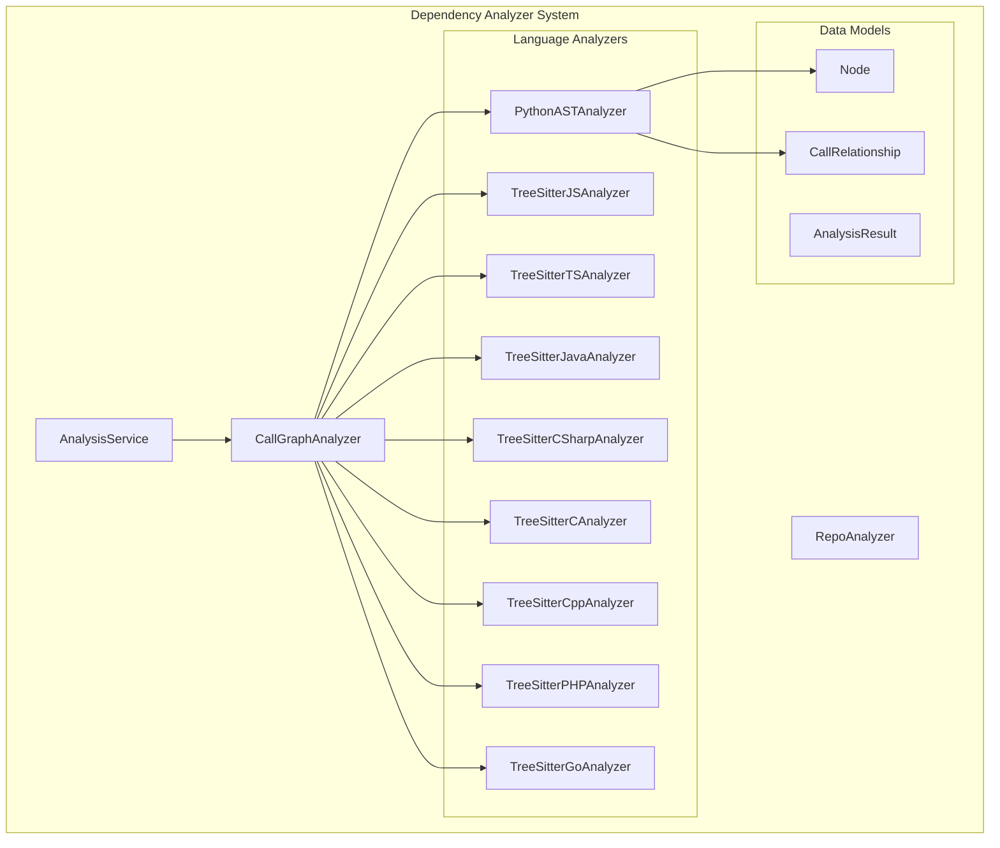
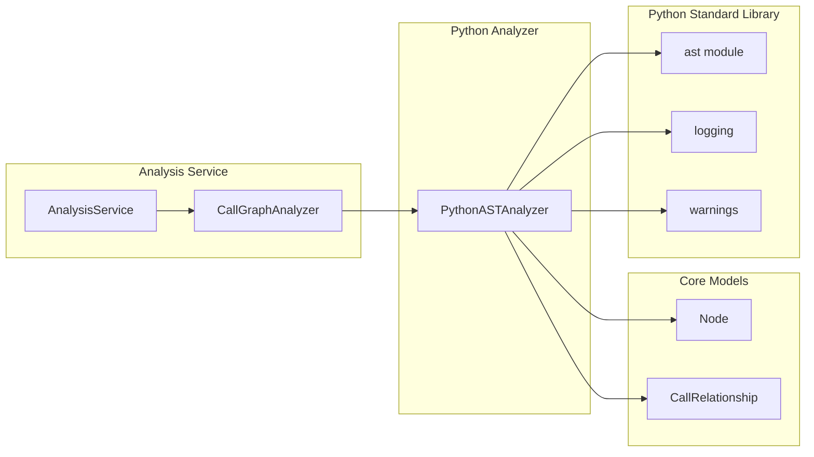
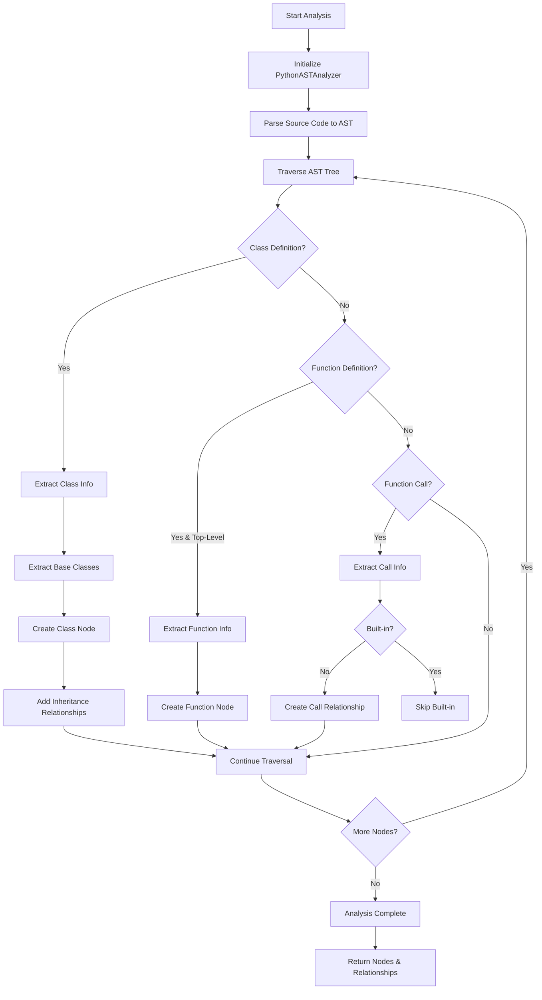
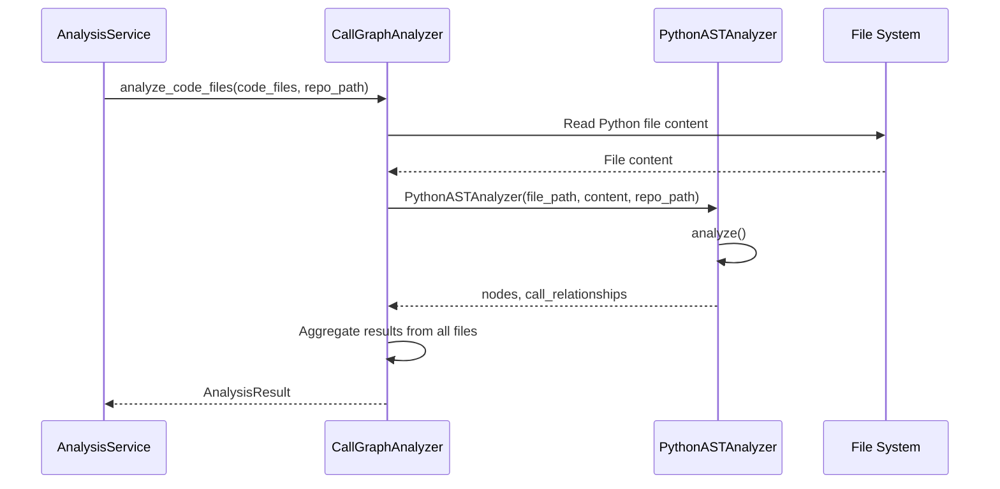

# Python Analyzer Module

## Overview

The **Python Analyzer** module is a specialized component within the [dependency_analyzer](dependency_analyzer.md) system that performs static analysis of Python source code using Python's Abstract Syntax Tree (AST). It extracts code components (classes and functions) and identifies call relationships between them, enabling dependency graph generation and code structure visualization.

This module is part of a multi-language analyzer framework that supports Python, JavaScript, TypeScript, Java, C#, C, C++, PHP, and Go. Each language has its dedicated analyzer implementation following a consistent interface pattern.

## Architecture

### Position in System Architecture



### Module Dependencies



## Core Component: PythonASTAnalyzer

### Class Definition

The `PythonASTAnalyzer` is the central class responsible for parsing and analyzing Python source code. It extends Python's built-in `ast.NodeVisitor` class to traverse the AST and extract relevant information.

```python
class PythonASTAnalyzer(ast.NodeVisitor):
    """
    AST-based analyzer for Python source code.
    
    Extracts:
    - Class definitions with inheritance information
    - Top-level function definitions
    - Call relationships between components
    """
```

### Constructor Parameters

| Parameter | Type | Description |
|-----------|------|-------------|
| `file_path` | `str` | Absolute path to the Python file being analyzed |
| `content` | `str` | Raw source code content of the file |
| `repo_path` | `Optional[str]` | Repository root path for calculating relative paths |

### Key Attributes

| Attribute | Type | Description |
|-----------|------|-------------|
| `nodes` | `List[Node]` | Collection of extracted code components (classes and functions) |
| `call_relationships` | `List[CallRelationship]` | Collection of call relationships between components |
| `top_level_nodes` | `Dict` | Mapping of component names to their Node objects for quick lookup |
| `current_class_name` | `Optional[str]` | Name of the class currently being visited (for context tracking) |
| `current_function_name` | `Optional[str]` | Name of the function currently being visited (for context tracking) |

### Public Methods

#### `analyze()`

Executes the complete analysis process on the provided Python source code.

**Process:**
1. Parses the source code into an AST (with SyntaxWarning suppression)
2. Traverses the AST using visitor pattern
3. Extracts classes, functions, and call relationships
4. Logs analysis results

**Error Handling:**
- `SyntaxError`: Logged as warning, analysis skipped for that file
- Other exceptions: Logged as error with full traceback

#### `analyze_python_file()` (Module-level function)

Convenience function that creates an analyzer instance and returns results.

**Parameters:**
| Parameter | Type | Description |
|-----------|------|-------------|
| `file_path` | `str` | Path to the Python file |
| `content` | `str` | Content of the Python file |
| `repo_path` | `Optional[str]` | Repository root path |

**Returns:**
```python
Tuple[List[Node], List[CallRelationship]]
```

### Visitor Methods

The analyzer uses the visitor pattern to process different AST node types:

| Method | AST Node Type | Purpose |
|--------|---------------|---------|
| `visit_ClassDef()` | `ast.ClassDef` | Extract class definitions with base classes |
| `visit_FunctionDef()` | `ast.FunctionDef` | Extract synchronous function definitions |
| `visit_AsyncFunctionDef()` | `ast.AsyncFunctionDef` | Extract asynchronous function definitions |
| `visit_Call()` | `ast.Call` | Record function/method call relationships |
| `generic_visit()` | All nodes | Continue AST traversal to child nodes |

### Helper Methods

| Method | Purpose |
|--------|---------|
| `_get_relative_path()` | Calculate file path relative to repository root |
| `_get_module_path()` | Convert file path to Python module path (dot-separated) |
| `_get_component_id()` | Generate unique component identifier |
| `_extract_base_class_name()` | Extract base class name from inheritance AST nodes |
| `_process_function_node()` | Common logic for function/async function processing |
| `_should_include_function()` | Filter functions (excludes test functions) |
| `_get_call_name()` | Extract callable name from call AST nodes, filtering built-ins |

## Data Models

### Node

Represents a code component (class or function) extracted from analysis.

**See:** [dependency_analyzer.md](dependency_analyzer.md#node) for complete model specification.

**Key Fields Used by Python Analyzer:**
- `component_type`: `"class"` or `"function"`
- `node_type`: `"class"` or `"function"`
- `base_classes`: List of base class names (for classes only)
- `parameters`: List of parameter names (for functions only)
- `docstring`: Extracted docstring content
- `has_docstring`: Boolean indicating docstring presence

### CallRelationship

Represents a call relationship between two code components.

**See:** [dependency_analyzer.md](dependency_analyzer.md#callrelationship) for complete model specification.

**Fields:**
- `caller`: Component ID of the calling component
- `callee`: Component ID of the called component
- `call_line`: Line number where the call occurs
- `is_resolved`: Whether the callee was found in the analyzed code

## Analysis Process Flow



## Integration with Analysis Service

The Python Analyzer integrates with the [AnalysisService](dependency_analyzer.md#analysisservice) through the `CallGraphAnalyzer`:



### Supported File Types

- `.py` - Standard Python files
- `.pyx` - Cython Python files

### Filtering Rules

The analyzer applies the following filtering rules:

1. **Function Inclusion**: Only top-level functions are included (methods within classes are not extracted as separate nodes)
2. **Test Function Exclusion**: Functions starting with `_test_` are excluded
3. **Built-in Filtering**: Calls to Python built-ins (e.g., `print`, `len`, `str`) are not recorded as relationships

## Comparison with Other Language Analyzers

| Feature | Python | JavaScript/TypeScript | Java/C# | C/C++ | PHP | Go |
|---------|--------|----------------------|---------|-------|-----|-----|
| Parser | AST (built-in) | Tree-sitter | Tree-sitter | Tree-sitter | Tree-sitter | Tree-sitter |
| Class Support | ✓ | ✓ | ✓ | ✓ | ✓ | ✓ |
| Function Support | ✓ (top-level) | ✓ | ✓ | ✓ | ✓ | ✓ |
| Method Support | ✗ | ✗ | ✗ | ✗ | ✗ | ✗ |
| Inheritance Tracking | ✓ | ✓ | ✓ | ✓ | ✓ | ✓ |
| Async Function Support | ✓ | ✓ | ✗ | ✗ | ✗ | ✗ |
| Docstring Extraction | ✓ | ✓ | ✓ | ✓ | ✓ | ✓ |

**Note:** All analyzers follow the same interface pattern, returning `List[Node]` and `List[CallRelationship]`.

## Usage Examples

### Basic File Analysis

```python
from codewiki.src.be.dependency_analyzer.analyzers.python import analyze_python_file

# Read Python file
with open('example.py', 'r') as f:
    content = f.read()

# Analyze the file
nodes, relationships = analyze_python_file(
    file_path='/path/to/example.py',
    content=content,
    repo_path='/path/to/repo'
)

# Process results
for node in nodes:
    print(f"Found {node.component_type}: {node.name}")
    
for rel in relationships:
    print(f"{rel.caller} -> {rel.callee} (line {rel.call_line})")
```

### Using with AnalysisService

```python
from codewiki.src.be.dependency_analyzer.analysis.analysis_service import AnalysisService

service = AnalysisService()

# Analyze a local repository (Python only)
result = service.analyze_local_repository(
    repo_path='/path/to/repo',
    max_files=50,
    languages=['python']
)

print(f"Analyzed {result['summary']['total_files']} files")
print(f"Found {result['summary']['total_nodes']} components")
print(f"Found {result['summary']['total_relationships']} relationships")
```

## Error Handling

The analyzer implements robust error handling:

1. **Syntax Errors**: Files with syntax errors are logged and skipped
2. **Encoding Issues**: Handled by the file reading layer before analysis
3. **Invalid Escape Sequences**: SyntaxWarnings are suppressed (common in regex patterns)
4. **Unexpected AST Structures**: Caught and logged without crashing the analysis

## Performance Considerations

- **AST Parsing**: Python's built-in `ast.parse()` is highly optimized
- **Memory Usage**: Source code is split into lines once and reused
- **Traversal**: Single-pass AST traversal using visitor pattern
- **Scalability**: Files are analyzed independently, enabling parallel processing at the `CallGraphAnalyzer` level

## Limitations

1. **Method Extraction**: Methods within classes are not extracted as separate nodes (only the class itself)
2. **Dynamic Calls**: Runtime-dynamic calls (e.g., `getattr(obj, 'method')()`) are not detected
3. **Import Resolution**: Cross-module imports are tracked as unresolved relationships unless the target is in the same file
4. **Type Annotations**: Type hints are not currently extracted or analyzed
5. **Decorators**: Decorator information is not captured in the Node model

## Related Modules

- **[dependency_analyzer.md](dependency_analyzer.md)**: Parent module documentation
- **[javascript_typescript_analyzers.md](javascript_typescript_analyzers.md)**: JavaScript/TypeScript analyzers
- **[java_csharp_analyzers.md](java_csharp_analyzers.md)**: Java/C# analyzers
- **[c_cpp_analyzers.md](c_cpp_analyzers.md)**: C/C++ analyzers
- **[php_go_analyzers.md](php_go_analyzers.md)**: PHP/Go analyzers
- **[documentation_generator.md](documentation_generator.md)**: Uses analysis results for documentation generation

## File Location

```
codewiki/src/be/dependency_analyzer/analyzers/python.py
```

## Key Classes and Functions

| Name | Type | Description |
|------|------|-------------|
| `PythonASTAnalyzer` | Class | Main analyzer class extending `ast.NodeVisitor` |
| `analyze_python_file()` | Function | Convenience function for single-file analysis |

## Version Information

- **Python Version**: Requires Python 3.10+ (uses union type syntax `str | None`)
- **Dependencies**: Python standard library only (`ast`, `logging`, `warnings`, `pathlib`, `sys`, `os`)
